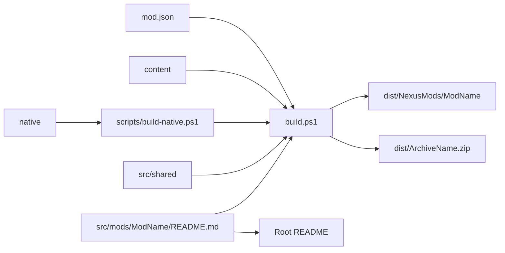

# Multi-mod build system

The root build discovers one manifest in each `src/mods/<ModName>` directory.
Each manifest supplies package identity and optional native build metadata.



## Manifest contract

The manifest directory name must equal its `id` value.
The build validates required text, Boolean values, identifiers, and archive names.

```json
{
  "$schema": "../../../schemas/mod.schema.json",
  "id": "MorePlayers",
  "displayName": "Wayfinder MorePlayers",
  "archiveName": "Wayfinder-MorePlayers-NexusMods.zip",
  "includeWayfinderSignature": true,
  "native": {
    "target": "MorePlayersSteamLimit"
  }
}
```

The `native` property is optional.
When present, its target must exist in the adjacent `native/CMakeLists.txt` file.

## Directory contract

```text
src/mods/<ModName>/mod.json
src/mods/<ModName>/README.md
src/mods/<ModName>/content/
src/mods/<ModName>/native/
```

The build copies each `content` child into `Mods/<ModName>`.
The build copies an optional native target to `dlls/main.dll`.
The build copies the shared Wayfinder signature when the manifest enables it.

Native output uses `build/native/<ModName>/<Configuration>`.
Nexus Mods output uses `dist/NexusMods/<ModName>`.

## Documentation contract

The root `README.md` lists each mod, contributor guidance, build usage, and the repository layout.
Each `src/mods/<ModName>/README.md` file contains the complete mod guide.
The build copies the same mod README into the generated package.
The TOC script updates the root, mod, and native README files.
The TOC script reads strict UTF-8 and writes UTF-8 without a byte-order mark.
Invalid UTF-8 stops the update instead of replacing or expanding text.

## Commands

Build all discovered mods:

```powershell
.\build.ps1
```

Build selected mods:

```powershell
.\build.ps1 -Mod MorePlayers
.\build.ps1 -Mod MorePlayers,AnotherMod
```

List discovered mods:

```powershell
.\build.ps1 -ListMods
```

Use `-SkipNativeBuild` only when the selected native output exists.
Use `-NoArchive` to create unpacked package directories without ZIP files.

## Invariants

- Mod identifiers are unique.
- Archive file names are unique.
- Generated paths remain under `build` or `dist`.
- The root build contains no mod-specific source paths.
- A Lua-only mod does not need a `native` directory.
- Each mod has a complete source README.
- The source README and packaged README contain identical text.
- TOC updates reject invalid UTF-8 input.

Related: [Distribution summary](summary.md),
[Project practices](../practices.md), and [Project summary](../summary.md).
