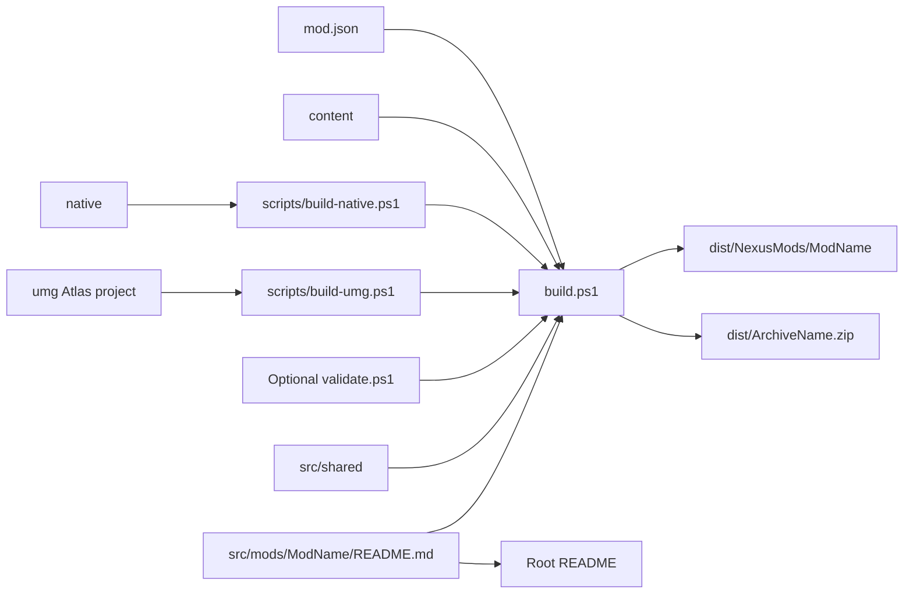

# Multi-mod build system

The root build discovers one manifest in each `src/mods/<ModName>` directory.
Each manifest supplies package identity and optional native and UMG metadata.



## Manifest contract

The manifest directory name must equal its `id` value.
The build validates required text, Boolean values, identifiers, and archive names.

```json
{
  "$schema": "../../../schemas/mod.schema.json",
  "id": "MorePlayers",
  "displayName": "Wayfinder MorePlayers",
  "archiveName": "Wayfinder-MorePlayers-NexusMods.zip",
  "includeWayfinderSignature": true,
  "native": {
    "target": "MorePlayersSteamLimit"
  }
}
```

The `native` property is optional.
When present, its target must exist in the adjacent `native/CMakeLists.txt` file.

The `validation` property is optional. Its script runs before compilation and
again after the distribution files exist.

```json
{
  "validation": { "script": "validate.ps1" }
}
```

The `umg` property is optional. It defines an Unreal Engine 4.27 project, Pak
name, `/Game/Mods` asset root, and required cooked assets.

```json
{
  "umg": {
    "project": "umg/Atlas.uproject",
    "pakName": "Loadouts.pak",
    "assetRoot": "/Game/Mods/Loadouts",
    "requiredAssets": ["ModActor.uasset"]
  }
}
```

## Directory contract

```text
src/mods/<ModName>/mod.json
src/mods/<ModName>/README.md
src/mods/<ModName>/content/
src/mods/<ModName>/native/
src/mods/<ModName>/umg/
src/mods/<ModName>/validate.ps1
```

The build copies each `content` child into `Mods/<ModName>`.
The build copies an optional native target to `dlls/main.dll`.
The build copies an optional Pak to `Atlas/Content/Paks/LogicMods`.
The build copies the shared Wayfinder signature when the manifest enables it.

Native output uses `build/native/<ModName>/<Configuration>`.
UMG output uses `build/umg/<ModName>/pak`.
Nexus Mods output uses `dist/NexusMods/<ModName>`.

Loadouts uses both optional build paths. Its native target is
`LoadoutsEventRelay`, and its UMG package is `Loadouts.pak`.

```json
{
  "native": { "target": "LoadoutsEventRelay" },
  "umg": { "pakName": "Loadouts.pak" }
}
```

Loadouts opts into offline validation. The source phase compiles the vendored
Lua 5.4.4 parser and checks every packaged Lua source. Static guards reject
unsafe reflected service calls and unsafe UI discovery paths. They require the
exact Character page hook, Wayfinder button class, confirmation API, and dye
bridge contract.

The source phase also enforces the UE4SS 3.0.1 virtual table. Reload-safety
guards require native module pinning, one callback registration, and queued
event generation checks. The package phase checks required files, Lua source
hashes, and the exact relay export set.

The Loadouts native target rejects the `Debug` configuration. Its
`std::function` callback boundary must use the shipping UE4SS 3.0.1 MSVC
standard-library ABI.

## Documentation contract

The root `README.md` lists each mod, contributor guidance, build usage, and the repository layout.
Each `src/mods/<ModName>/README.md` file contains the complete mod guide.
The build copies the same mod README into the generated package.
The TOC script updates the root, mod, and native README files.
The TOC script preserves the existing line ending style in each README file.
The TOC script reads strict UTF-8 and writes UTF-8 without a byte-order mark.
Invalid UTF-8 stops the update instead of replacing or expanding text.

## Commands

Build all discovered mods:

```powershell
.\build.ps1
```

Build selected mods:

```powershell
.\build.ps1 -Mod MorePlayers
.\build.ps1 -Mod MorePlayers,AnotherMod
```

List discovered mods:

```powershell
.\build.ps1 -ListMods
```

Use `-SkipNativeBuild` only when the selected native output exists.
Use `-SkipUmgBuild` only when the selected Pak and its verified `.sha256` file exist.
Use `-UnrealRoot` or `WAYFINDER_UE427_ROOT` for a UMG build.
Use `-NoArchive` to create unpacked package directories without ZIP files.

## Invariants

- Mod identifiers are unique.
- Archive file names are unique.
- Generated paths remain under `build` or `dist`.
- The root build contains no mod-specific source paths.
- A Lua-only mod does not need a `native` directory.
- A mod without UMG assets does not need an `umg` directory.
- A UMG cook uses an exact Unreal Engine 4.27 installation.
- An optional validation script runs only for a mod that declares it.
- Loadouts Lua sources parse with the vendored Lua 5.4.4 compiler.
- Loadouts source guards reject legacy reflected arrays and unsafe global UI discovery.
- Loadouts source guards require the exact launcher, confirmation, and dye bridge contracts.
- Loadouts native guards require module pinning, one callback, and stale-generation rejection.
- The Loadouts relay exports only `start_mod` and `uninstall_mod`.
- Pak paths remain below `../../../Atlas/Content/Mods/<ModName>`.
- Pak verification checks the UnrealPak mount point and each relative asset path.
- A Pak cannot contain executable code.
- Each mod has a complete source README.
- The source README and packaged README contain identical text.
- TOC updates do not change a README file's line ending style.
- TOC updates reject invalid UTF-8 input.

Related: [Distribution summary](summary.md),
[Project practices](../practices.md), and [Project summary](../summary.md).
