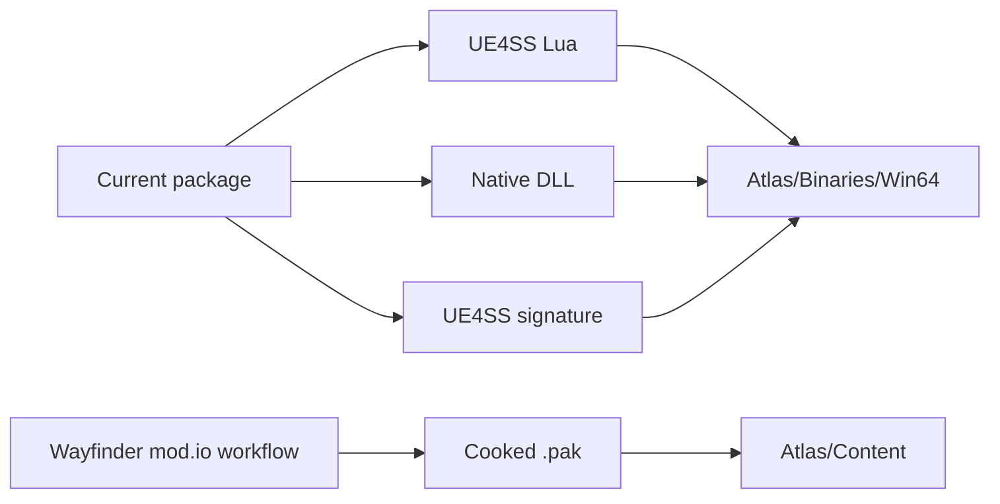

# mod.io distribution

The current native package is not a supported Wayfinder mod.io subscription
package. Wayfinder's published workflow accepts cooked Unreal content in a
`.pak` file, with an optional `ModConfig.ini`, and explicitly excludes code
mods from that guide.



## Distribution contract

- Do not present the current package as a one-click Wayfinder mod.io install.
- The standard Wayfinder mod.io workflow is for `.pak` content, not UE4SS code.
- mod.io scans DLL files and each game can flag or block them with its file
  schema. There is no platform-wide rule that forbids every DLL.
- A mod.io release containing the native DLL requires explicit approval from
  the Wayfinder game administrators and a supported installation path for
  files under `Atlas/Binaries/Win64`.
- Until those requirements exist, publish the native package as a documented
  manual Windows installation, such as the Nexus Mods output.

## Native path example

```text
Atlas/Binaries/Win64/Mods/MorePlayers/dlls/main.dll
```

The Wayfinder creator guide is at
<https://mod.io/g/wayfinder/r/how-to-create-custom-content>. The mod.io scanner
documentation is at <https://docs.mod.io/moderation/automated-scanning/>.

Related: [Distribution summary](summary.md),
[Runtime summary](../runtime/summary.md), and
[Project practices](../practices.md).
