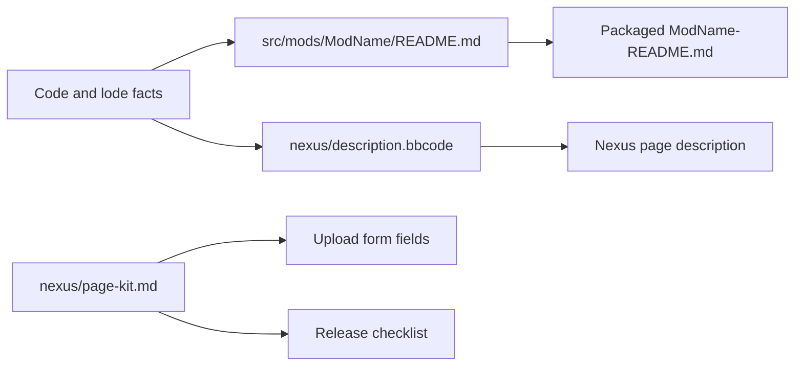

# Nexus Mods page kit

Each released mod has a page kit in `src/mods/<ModName>/nexus/`. The kit holds
the text for the Nexus Mods page and the upload form. The build does not
package the kit. The user creates the page, uploads the archive, and
publishes.



## Files

```text
src/mods/MorePlayersPlus/nexus/description.bbcode
src/mods/MorePlayersPlus/nexus/page-kit.md
src/mods/SkipStartupWarnings/nexus/description.bbcode
src/mods/SkipStartupWarnings/nexus/page-kit.md
```

- `description.bbcode` is the complete page description. It uses only
  `[b]`, `[size]`, `[list]`, `[list=1]`, `[*]`, `[code]`, `[url]`, and `[line]`.
- `page-kit.md` holds the summary, file name, file description, requirements,
  permission rows, credits, tags, changelog, screenshot list, and release
  checklist. The MorePlayersPlus kit holds the checklist for both mods.

## Contracts

- The page and the packaged README state the same facts. A change to one needs
  the same change to the other, then a rebuild of the archive.
- Each claim has support in the code or the lode. A claim that only an earlier
  build proved names that build.
- The page states each known limit, including untested items.
- No text or screenshot shows names or online IDs of other players.
- The file name has no version. The version field holds it.
- Both pages use the tags `AI-Generated Content` (code) and `AI Media` (page
  text). The user chose these tags.
- Both pages credit FuniWF for the `GUObjectArray.lua` signature. The
  MorePlayersPlus page also credits FuniWF for the Lua session-limit approach.
- The MorePlayersPlus page credits MinHook and its Hacker Disassembler Engine.
- The text uses Simplified Technical English. Sentences have no more than 25
  words.

Example of a supported limit statement:

```text
[*]Version 1.0.0 has not yet been tested with a joining player. In the normal mode, version 1.0.0 activates no MinHook hook.
```

## Signature origin

`src/shared/UE4SS_Signatures/GUObjectArray.lua` has the same AOB and the same
`OnMatchFound` body as FuniWF's public UE4SS setup guide for Wayfinder. FuniWF
links the guide from Wayfinder mod 9. The file entered this repository in
commit `761cc85`.

```lua
function OnMatchFound(MatchAddress)
    local JmpInstr = MatchAddress + 24
    return JmpInstr + DerefToInt32(JmpInstr) + 4
end
```

FuniWF's recorded permission covers the Lua session-limit approach. The text
says "used with FuniWF's permission" for the signature only after FuniWF
confirms it.

## BBCode rules

Nexus BBCode has no `[noparse]` tag. Log prefixes such as `[MorePlayersPlus]`
stay inside `[code]` blocks. The kit puts no `[code]` block inside a numbered
list item, because that can break the numbering. Paths in list steps are plain
text.

```text
[list=1]
[*]Delete the folder Wayfinder\Atlas\Binaries\Win64\Mods\MorePlayersPlus.
[/list]
```

## Lessons learned

Adversarial review found these false claims in the first drafts:

- "The DLL changes no instruction" on a byte mismatch. The DLL patches each
  instruction group on its own. The threshold group runs only after the
  capacity group applies.
- "The limit is in the Steam join information." Only the Discord party data
  carries the party maximum. The Steam `connect` key has no player count.
- "The mod installs no hook." The Lua script always registers UE4SS hooks.
  Only the native DLL skips MinHook in the normal mode.
- "Changes only the values Wayfinder sends." In the fallback mode, the DLL sets
  the host's Steam rich presence itself.
- The archive lists missed `enabled.txt` and the root README file.

Related: [Nexus Mods release plan](../plans/nexus-release.md),
[Distribution summary](summary.md), [Build system](build-system.md), and
[Capacity checks in Wayfinder.exe](../runtime/capacity-binary-map.md).
