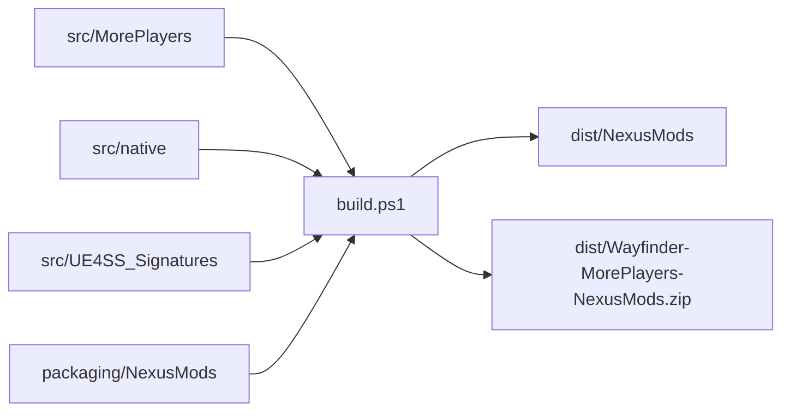

# Distribution

The root build script creates hosting-site files from source and packaging
templates. Generated files do not belong in Git.



## Nexus Mods contract

- The archive root contains `Atlas` and `README.md`.
- Users extract the archive into the Wayfinder installation directory.
- The archive includes the Lua script, native DLL, configuration, and signature.
- The archive does not include UE4SS binaries.
- The Nexus README links to UE4SS 3.0.1.
- User configuration instructions point to the installed `config.ini` file.
- Build instructions identify `src/MorePlayers/config.ini` as the package default.

## Build example

```powershell
.\build.ps1
```

## Configuration example

```text
Wayfinder\Atlas\Binaries\Win64\Mods\MorePlayers\config.ini
```

Use `-SkipNativeBuild` to reuse the current DLL. Use `-NoArchive` to generate
only the unpacked directory.

Related: [Project practices](../practices.md), [Project summary](../summary.md), and [Roadmap](../plans/roadmap.md).
