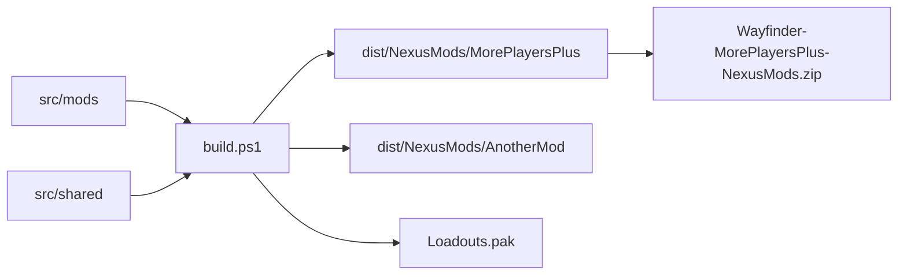

# Distribution

The root build creates one hosting package for each selected mod manifest.
Generated native files and distribution files do not belong in Git.



## Multi-mod contract

- Each `src/mods/<ModName>` directory contains `mod.json` and `content`.
- Each mod can contain an optional `native` CMake project.
- Each mod can contain an optional Unreal Engine 4.27 UMG project.
- Each mod has a `README.md` file for source and package documentation.
- `build.ps1` builds all mods when `-Mod` is absent.
- `build.ps1 -Mod <ModName>` builds only the selected mod.
- Each generated package uses `dist/NexusMods/<ModName>`.
- Each manifest defines its unique ZIP file name.

## MorePlayersPlus package

- The archive root contains `Atlas` and `README.md`.
- Users extract the archive into the Wayfinder installation directory.
- The archive includes the Lua script, native DLL, configuration, and signature.
- The archive does not include UE4SS binaries.
- The Nexus README links to UE4SS 3.0.1.
- User configuration instructions point to the installed `config.ini` file.
- Build instructions identify `src/mods/MorePlayersPlus/content/config.ini`.

## Build example

```powershell
.\build.ps1 -Mod MorePlayersPlus
```

## Output example

```text
dist/NexusMods/MorePlayersPlus/Atlas/Binaries/Win64/Mods/MorePlayersPlus
dist/Wayfinder-MorePlayersPlus-NexusMods.zip
```

Use `-SkipNativeBuild` to reuse the current DLL.
Use `-SkipUmgBuild` to reuse the current verified Pak.
Use `-NoArchive` to generate only the unpacked directory.

The current native package requires manual installation.
It is not a supported Wayfinder mod.io subscription package.
See [mod.io distribution](mod-io.md).

Related: [Build system](build-system.md),
[Project practices](../practices.md), and [Project summary](../summary.md).
