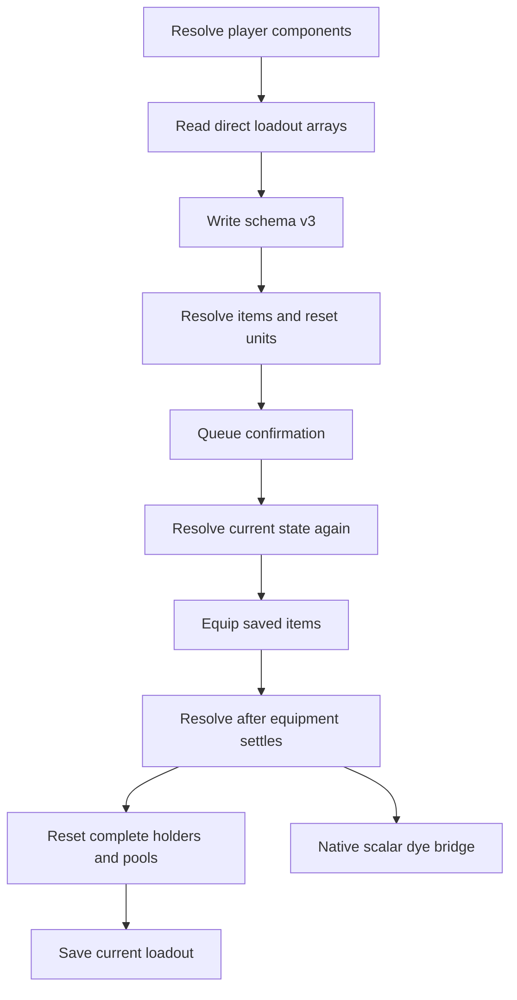

# Loadouts service

`main.lua` owns profile persistence, capture, validation, confirmation, and
application. UI code receives service callbacks and does not access the
database or reflected loadout functions directly.



## Database contract

The database schema version is 3. Each `PROFILE` record stores trust flags in
this order: Echoes, item talents, archetype nodes, styles, and dyes.

```lua
local DATABASE_TEMP_PATH = DATABASE_PATH .. ".tmp"
local DATABASE_BACKUP_PATH = DATABASE_PATH .. ".bak"
local DATABASE_VERSION = 3
```

New captures set every trust flag. Version 1 and version 2 migration clears
all five flags. Older schemas cannot distinguish an intentional empty section
from an incomplete capture.

Migration converts old Echo and ability positions from one-based values to
zero-based engine slots. Version 1 items have no slot field. A profile without
verified Character and equipment-slot data remains stored but cannot apply.

Save writes every profile to `loadouts.db.tmp`. The service closes and parses
that file before replacement. It moves the current database to
`loadouts.db.bak`, then renames the validated temporary file.

A failed final rename restores the backup when possible. Save, rename, and
delete restore their in-memory profile state when persistence fails.

If the live database is missing at startup, recovery checks the temporary file
first and the backup second. The service accepts only a candidate that parses
successfully. It ignores and logs each invalid candidate. A valid candidate
loads into memory even when its rename to the live path fails.

## Reflection contract

UE4SS 3.0.1 requires one Lua table for each reflected non-const output
parameter. The service reads the returned value and the named value inside the
output table.

```lua
local result = {}
archetype:GetArchetypeTreeNodeByTypeAndID(tree_type, node_id, result)
local definition = out_value(result, "Node")
```

Lua does not call an inventory function that returns `FInventoryItemEntry`.
UE4SS 3.0.1 represents nested returned-array elements with transient wrappers,
and a large reflected array conversion can corrupt the Lua stack.

```text
LoadoutsNativeCaptureItem(inventory, table, row, A, B, C, D)
```

The native relay initializes a raw `FindItem` parameter buffer, calls
`ProcessEvent`, copies every required value to native-owned storage, and
destroys the parameter buffer. It resolves attached Echo handles and talent
pools through native buffers before it serializes only strings, integers, and
Booleans to Lua. Lua validates the complete returned handle. A mismatch or any
invalid array fails capture before persistence.

The relay reads Lua arguments by fixed stack index because LuaMadeSimple getters
do not remove values. Before buffer initialization, it verifies the live
parameter size and return offset for `FindItem`, `FindItemFromId`, and
`GetTalentPoolForTalent`. A layout mismatch keeps the capture bridge unavailable.

The service does not convert `m_DataReplicators`, call
`GetInitialChangesForAllItems`, or retain an `InventoryItemEntry` wrapper in
Lua. A complete-handle identity joins current loadout items to equipment slots,
so duplicate item rows cannot select the wrong inventory instance. Capture
rejects an equipped zero-GUID holder because schema v3 holder relationships use
the GUID.

Returned nested arrays can become ordinary Lua tables. Direct UObject array
properties remain UE4SS userdata. `each_array` accepts both representations.

`InventoryLoadoutItem.AttachedFogSouls` is not read. The native item snapshot
copies `InventoryItemSpec.FogSouls` and resolves each nonzero Echo ID while the
native buffers are valid.

```lua
local entry = get_item_entry(inventory, holder)
each_array(entry.Spec.FogSouls, capture_echo)
```

Capture reads the component-owned `m_Loadouts.m_Loadouts` and
`m_equipmentSlots` arrays. Every current item must match an equipped slot. It
copies loadout, style, slot, and item-handle fields to plain Lua values while
each array callback is active. It makes no inventory UFunction call from those
callbacks. The native item snapshot supplies the exact equipped slot name. An
empty or `None` native slot keeps the verified component-owned slot fallback.

Archetype capture reads `m_ArchetypeTreeData[].UnlockedNodes` for
`m_CurrentCharacter`. Node validation supplies an output table to
`GetArchetypeTreeNodeByTypeAndID` before a tree reset.

## GUID word contract

Wayfinder reflection exposes each live GUID word as a signed 32-bit integer.
The service canonicalizes each word to `0..4294967295` for database records,
holder identifiers, comparisons, and native dye arguments.

```text
reflected -1 -> stored 4294967295 -> reflected -1
legacy 18446744073709551615 -> canonical 4294967295
```

The parser accepts legacy signed values and canonical unsigned values.
It reduces each decimal word in a legacy 64-bit `%u` holder key modulo
`4294967296`. This conversion makes old holder references match new keys.

`make_handle` converts a canonical value above `2147483647` back to signed
32-bit form before reflection. The native dye bridge receives only canonical
unsigned words.

## Reset contract

Preflight creates conservative block sets before any state change:

```lua
blocked_echo_holders = {}
blocked_talent_holders = {}
blocked_talent_pools = {}
blocked_dye_holders = {}
```

- A missing Echo, host, or slot blocks the complete Echo set for that holder.
- An unreadable current Echo array preserves all affected holders.
- A missing dye blocks the complete dye set for that holder.
- An unavailable native bridge preserves every dye set.
- A missing talent blocks its holder or its identified talent pool.
- An unreadable talent allocation blocks its holder before a reset.
- An unavailable style blocks the complete armor or weapon style set.
- An invalid archetype node preserves the complete archetype tree.

Empty trusted sets can reset current data. Empty untrusted legacy sets cannot
reset data. This invariant protects data that an older capture omitted.

The service resolves the profile after equipment settles. It combines the new
result with the approved block policy. A later resolution cannot remove a
protection that the user confirmed.

## Native dye contract

The Lua binding cannot convert a Lua table to the reflected dye map `TArray`.
Lua passes the live inventory object path, item fields, dye row, and map
identifiers as scalar arguments to `LoadoutsNativeApplyDye`.

The native bridge builds the exact parameter layout and invokes:

```text
/Script/Wayfinder.PlayerInventoryComponent:ApplyDyeToItem
```

The bridge resolves the inventory path, verifies its
`PlayerInventoryComponent` class, and verifies both resolved `DataTable`
objects before `ProcessEvent`. It returns Wayfinder's Boolean result. The service calls
`LoadoutsNativeDyeReady` before any dye reset. It resets one holder only when
the bridge and the holder's complete saved dye set are ready.

## Confirmation contract

Missing parts and reset notices create one pending confirmation.
The UMG page reads `pending_confirmation` and shows an inline panel.
The console uses `LoadoutConfirm` and `LoadoutCancel`.

Confirm resolves current state again. If the warning text changed, the service
updates the pending confirmation and applies nothing. The user must review and
confirm the new state.

Cancel clears the request without changing the current configuration.
The service rejects a second apply request while a confirmation is pending.
No Wayfinder popup participates in this contract.

## Failure boundary

A new application increments `apply_generation`. Each delayed operation checks
that generation before it accesses the current player components.

Wayfinder can still reject an official equip, reset, upgrade, or save call.
The service logs these failures and does not grant replacement items.

Related: [Loadouts summary](summary.md), [Loadouts interface](ui.md),
[Loadouts validation plan](../plans/loadouts.md), and
[Runtime reflection](../runtime/reflection.md).
