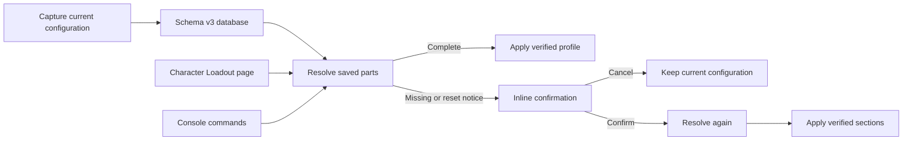

# Loadouts summary

Loadouts is a work in progress and is not functional. Users must not install or
use the mod. Saving a loadout can crash Wayfinder, and other operations are incomplete.

Loadouts stores named character configurations in `Mods/Loadouts/loadouts.db`.
The Lua service captures, validates, confirms, and applies each profile.
The UMG page and console use the same service contract.



## Profile scope

- Style includes personas, dyes, armor styles, and weapon styles.
- Equipment includes armor, accessories, weapons, and the Character item.
- Echo data includes each inventory GUID and zero-based slot.
- Talent data includes item pools and archetype nodes.
- Ability data includes each row and zero-based slot.

An item record stores its data-table row, inventory GUID, and equipment-slot
name. The GUID distinguishes duplicate items and duplicate Echoes.

## Current safety contract

Loadouts resolves every saved part before it changes game state.
It never grants an item or changes inventory ownership.

Missing reset-sensitive data blocks only its safe reset unit.
Echo and dye protection is per item holder. Item talent protection is per
holder or pool. Style sets and the archetype tree remain unchanged unless
their complete saved sets validate.

Version 1 and version 2 profiles load with reset-sensitive trust flags cleared.
The user must overwrite these profiles to recapture trusted empty sections.
A profile without verified Character and equipment-slot data cannot apply.

```text
LoadoutApply "Boss Breaker"
LoadoutConfirm
LoadoutCancel
```

`LoadoutConfirm` resolves the profile again. Changed conditions replace the
pending warning and require another confirmation.

## Runtime boundary

The native companion relays UI events, captures inventory-item snapshots, and
applies dye map arrays. It returns only scalar snapshot records to Lua; Lua does
not receive an `InventoryItemEntry`.
The native module pins itself and registers one ProcessEvent callback.
Queued generations prevent stale events after a mod instance stops.
A native Loadouts upgrade requires a complete Wayfinder restart.

Offline validation covers Lua syntax, source contracts, package hashes, Pak
contents, native exports, and the UE4SS virtual table. Reflected application
operations and screen behavior still require a live Wayfinder test.

Related: [Loadouts service](service.md), [Loadouts interface](ui.md),
[Loadouts validation plan](../plans/loadouts.md), and
[Build system](../distribution/build-system.md).
