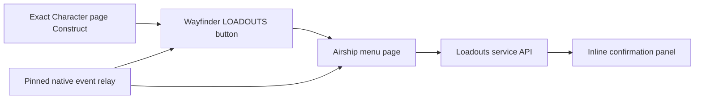

# Loadouts interface

Loadouts uses cooked Blueprint shells and a Lua-created UMG tree.
`loadout_ui.lua` owns launcher discovery, page widgets, focus, and screen
lifetime. `main.lua` remains the authority for every profile operation.



## Asset contract

The Unreal project is named `Atlas` and uses Unreal Engine 4.27.
All runtime assets are below `/Game/Mods/Loadouts`.

```text
/Game/Mods/Loadouts/ModActor
/Game/Mods/Loadouts/UI/WBP_LoadoutsPage
/Game/Mods/Loadouts/UI/WBP_LoadoutProfileRow
/Game/Mods/Loadouts/UI/WBP_LoadoutNameDialog
```

The assets use standard Unreal classes. Lua creates the live widget tree.
`WBP_LoadoutsPage` remains the viewport page when an Airship page cannot be
created. It is not a fallback button class.

## Launcher contract

The bridge loads and hooks this exact Character Loadout Blueprint class:

```lua
local CHARACTER_PAGE_CLASS_PATH =
    "/Game/UI/UI_WF_Blueprints/UI_WF_UIPages/" ..
    "UI_Page_CharacterLoadout_v2.UI_Page_CharacterLoadout_v2_C"
local CHARACTER_PAGE_CONSTRUCT_PATH = CHARACTER_PAGE_CLASS_PATH .. ":Construct"
```

The page asset is in `UI_WF_UIPages`, not its `Armory/NewStandalone`
subdirectory. The mounted Wayfinder patch Pak is the source of truth for this
path. The access-button asset remains in `Armory/NewStandalone`.

Startup calls `LoadAsset`, registers the exact Construct hook, and performs one
`FindAllOf("UI_Page_CharacterLoadout_v2_C")` scan. The scan finds a page that
already existed before hook registration. Later pages enter through Construct.

The bridge does not use `NotifyOnNewObject`. It does not hook a generic or fake
UserWidget Construct endpoint. It does not run a permanent discovery poll.

Each live Character page receives at most one launcher. The launcher and every
page action use this exact class:

```text
/Game/UI/UI_WF_Blueprints/UI_WF_UIPages/Armory/NewStandalone/UI_CharacterMenu_AccessButton.UI_CharacterMenu_AccessButton_C
```

There is no standard UMG button fallback. If the Wayfinder class cannot load,
the UI reports the failure instead of creating an inert control.

## Page contract

The page provides Save New, Apply, Overwrite, Rename, Delete, Refresh, and Back
actions. Rows show separate Armor, Weapon, Style, Echo, Talent, and Ability
counts. Invalid legacy profiles offer recapture actions and cannot apply.

The inline confirmation panel disables the profile list and other actions.
It receives these service callbacks:

```lua
pending_confirmation = pending_confirmation_data,
confirm = confirm_pending,
cancel = cancel_pending
```

Confirm and Cancel use the same pending state as the console commands.
The page does not create or depend on a Wayfinder popup.

The full page uses Wayfinder access buttons and explicit navigation links.
Refresh rebuilds the rows and restores controller focus.
Name key bindings accept letters, digits, spaces, and Backspace only while the
Loadouts page owns input.

## Lifetime and input contract

An Airship-managed page exists while `IsPageInStack` returns true.
Only `GetTopPage` determines whether Loadouts can process page input.
A temporary page above Loadouts does not cause premature state release.

```lua
local in_stack = current_menu_manager:IsPageInStack(current_page:GetFName())
local top_page = current_menu_manager:GetTopPage()
```

The bridge asks the Character page for its Airship parent and creates the base
Airship page before stack insertion. A player-screen root has no `UPanelWidget`
parent, so the bridge passes `nil` and uses Airship's player-screen host. It
builds the complete widget tree and sets `bStealInputFromBelow` while the page
is still unstacked, then calls `AddToAirshipMenu`. Wayfinder decides which page
owns controller input during that call; changing the flag afterward cannot
transfer ownership.

```lua
local parent = character_page:GetParent()
if not is_valid(parent) then
    parent = nil
end
local page = widget_library:Create(controller, airship_class, controller)
page.bStealInputFromBelow = true
page.bPreventDPadInputSuppressionForCustomEvents = false
build_page(page)
menu_library:AddToAirshipMenu(page, controller, parent)
```

The D-pad suppression flag remains false. In Wayfinder, false installs normal
Slate D-pad navigation; true reserves those inputs for custom page events.
The managed page remains attached through Airship until Airship removes it.
Only a page that fails managed insertion uses `AddToViewport` and viewport-slot
layout. A bare viewport page cannot receive Airship controller ownership.

The native page-removal event releases state immediately. A 100 ms lifecycle
check uses stack presence only when that event is unavailable.
An unmanaged viewport page restores its previous focus or game input when it
closes.

Controller Back and Escape remain owned by the Airship menu page.
The Lua bridge does not register those inputs or a global confirm input.

Button creation applies the Blueprint lock state and visual setup first. It
then applies the final input state. The outer wrapper, widget-tree root, and
launcher size box use `SelfHitTestInvisible`. The inner Airship button remains
`Visible`, enabled, focusable, and configured for `DownAndUp` mouse input.
Mouse and controller activation use the same Wayfinder press event.

```lua
button:isFeatureLocked(false)
button:visualSetup()
button:SetVisibility(SLATE_SELF_HIT_TEST_INVISIBLE)
button:SetIsEnabled(true)
target:SetVisibility(SLATE_VISIBLE)
target:SetIsEnabled(true)
target:SetClickMethod(BUTTON_INPUT_DOWN_AND_UP)
target:SetPressMethod(BUTTON_PRESS_DOWN_AND_UP)
```

Click and press policies are separate Slate contracts. Mouse uses ClickMethod;
controller Accept uses PressMethod. Both use `DownAndUp`.

`UAirshipMenuManager.TakeFocus` returns a Boolean. The bridge highlights a
button only after that value is true. A successful Lua call with a false return
does not prove that Airship accepted the focus target.

Mouse hover can focus the button before mouse-down. Each full-button focus
overlay uses `HitTestInvisible` while drawn. A `Visible` focus overlay would
cover `AirshipButton_159` and consume the mouse hit.

```lua
owner.Overlay_focusFrame:SetVisibility(
    focused and SLATE_HIT_TEST_INVISIBLE or SLATE_COLLAPSED
)
```

## Native relay contract

UE4SS 3.0.1 cannot add the required dynamic multicast button binding.
The button's component-bound press handler is Blueprint bytecode. Lua uses an
exact `RegisterHook` for that function because native ProcessEvent callbacks
are not the authority for Blueprint-only execution.

```lua
RegisterHook(WAYFINDER_BUTTON_PRESS_PATH, function(context_parameter)
    local owner = unwrap_parameter(context_parameter)
    local target = button_event_targets[object_address(owner)]
    activate_button(target, "Blueprint button event")
end)
```

`LoadoutsEventRelay` observes native focus and page-removal ProcessEvent calls.
It does not cache the asset-owned Blueprint press UFunction. It queues Lua
dispatch outside Unreal ProcessEvent.
The callback adds values to a bounded native queue. `on_update` swaps that
queue into local storage, releases its mutex, and then enters Lua. The relay
does not use the UE4SS event queue because that path can invert UE4SS locks.

The module pins its DLL before it registers the callback. An atomic guard
registers ProcessEvent once for the process lifetime.

```cpp
if (!pin_module())
{
    return nullptr;
}
if (!g_callback_registered.exchange(true))
{
    register_process_event(ProcessEventCallback(on_process_event));
}
```

```cpp
{
    std::lock_guard lock(g_event_mutex);
    events.swap(g_events);
}
for (const auto& event : events)
{
    dispatch_relay(event);
}
```

Each queued relay event stores the current generation. Dispatch rejects the
event when its generation differs from the active instance. This rule prevents
stale queued events from entering a stopped Lua instance.

The pinned module cannot activate replacement native code during the same game
process. Every native Loadouts upgrade requires a complete Wayfinder restart.

## Failure boundary

`EnableLoadoutUi=0` disables the UI bridge. If the Pak or page class cannot
load, console commands and quick-profile keys remain available.

Asset cook, Lua syntax, source contracts, and package checks pass offline.
Live verification must report a successful managed stack insertion and
`menu_target=true`. A focused Slate widget with `menu_target=false` does not own
Wayfinder's D-pad or Accept input.

Related: [Loadouts summary](summary.md), [Loadouts service](service.md),
[UMG and Pak validation plan](../plans/loadouts-umg-pak.md), and
[Build system](../distribution/build-system.md).
