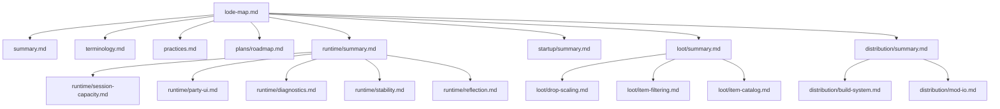

# Lode map

This index maps the persistent project knowledge. Read the core files before
you use the domain files.



## Core

- [Project summary](summary.md)
- [Terminology](terminology.md)
- [Project practices](practices.md)
- [Current roadmap](plans/roadmap.md)

## Runtime

- [Runtime summary](runtime/summary.md)
- [Session capacity](runtime/session-capacity.md)
- [Party UI](runtime/party-ui.md)
- [Runtime diagnostics](runtime/diagnostics.md)
- [Runtime stability](runtime/stability.md)
- [Runtime reflection](runtime/reflection.md)

## Distribution

- [Distribution summary](distribution/summary.md)
- [Multi-mod build system](distribution/build-system.md)
- [mod.io distribution](distribution/mod-io.md)

## Startup

- [Startup warning skip](startup/summary.md)

## Loot

- [Loot summary](loot/summary.md)
- [Drop scaling](loot/drop-scaling.md)
- [Item filtering](loot/item-filtering.md)
- [Item catalog](loot/item-catalog.md)

## Path example

```text
src/mods/MorePlayers/native/dllmain.cpp -> runtime/session-capacity.md
```

Related: [Project summary](summary.md) and [Project practices](practices.md).
