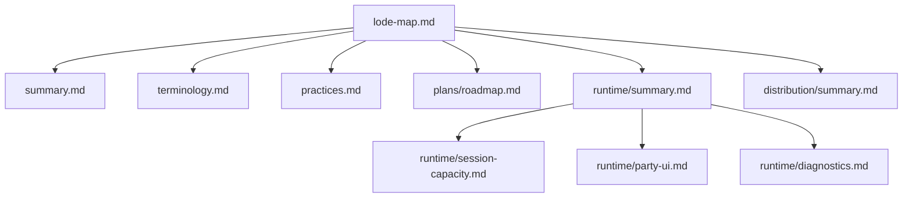

# Lode map

This index maps the persistent project knowledge. Read the core files before
you use the domain files.



## Core

- [Project summary](summary.md)
- [Terminology](terminology.md)
- [Project practices](practices.md)
- [Current roadmap](plans/roadmap.md)

## Runtime

- [Runtime summary](runtime/summary.md)
- [Session capacity](runtime/session-capacity.md)
- [Party UI](runtime/party-ui.md)
- [Runtime diagnostics](runtime/diagnostics.md)

## Distribution

- [Distribution summary](distribution/summary.md)

## Path example

```text
src/native/dllmain.cpp -> runtime/session-capacity.md
```

Related: [Project summary](summary.md) and [Project practices](practices.md).
