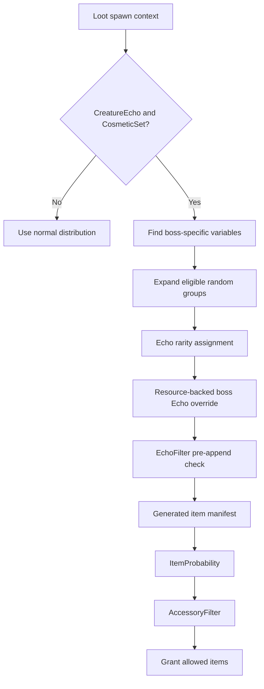

# Boss unique drops

MoreDrops can guarantee eligible boss-specific loot with
`DropAllUniques=true`. The feature applies only to boss-chest loot contexts.
The current Wayfinder data contains 50 such contexts. Each context contains
both `CreatureEcho` and `CosmeticSet` loot variables. No other current loot
source contains both variables.



## Configuration contract

The setting is disabled by default.

```ini
[BossDrops]
DropAllUniques=false

[EchoRarityOverride]
Bosses=Original
```

When the value is `true`, MoreDrops guarantees each eligible leaf item from
these boss-specific variable types:

- `UniqueResource`
- `CreatureEcho`
- `WeaponSet`
- `ArmorSet`
- `CosmeticSet`
- `PetSet`
- `TrophySet`
- `ProfileTitle`
- `AccessorySet`
- `AccessoryPool_Rare1`
- `AccessoryPool_Epic`
- `EventItem_1` and `EventItem_2`

`SummoningStone` is not a boss unique. Shared currency, spectra, gloomstone,
and other generic loot keep their normal distribution behavior.

`Bosses=Epic` changes any exact boss Echo row to Epic after Wayfinder assigns
its rarity. This classification does not depend on whether the delayed rarity
assignment is still inside the boss distribution call. The Echo rarity
allow-list then checks the Epic result.

## Distribution contract

Boss templates use weighted and uniform random groups. Setting probability to
`100` does not expand these groups. MoreDrops therefore uses the game's normal
distribution helpers once for each eligible group entry.

```cpp
if (boss_context && boss_unique_entry) {
    entry.probability = 10000.0f;
    expand_eligible_group_entries();
}
```

Wayfinder applies a level curve after the scalar probability. A value of
`10000` reaches the `100` guarantee threshold for each positive current curve
value. A curve value of `0` keeps a disabled level entry excluded.

The game continues to evaluate tag queries, level rules, and other
preconditions. An ineligible entry stays excluded. MoreDrops does not append
items directly to an Unreal array.

The `AP_Enemy_Boss` table is a router. MoreDrops keeps one normal selection
from its generic entries. It separately expands the source-specific Rare and
Epic accessory pools.

## Filter authority

The guarantee creates candidate drops. Existing filters remain authoritative.
An item must pass each applicable filter before Wayfinder grants it.

```text
boss guarantee -> EchoFilter -> item manifest -> ItemProbability -> AccessoryFilter
```

Thus, an item probability of `0` still blocks the item. A disallowed accessory
or Echo rarity also stays blocked. If `AllowedRarities` excludes Epic, a forced
Epic boss Echo stays blocked.

## Stability contract

- The feature fails open when the context or helper signatures are invalid.
- Helper hooks read existing arrays and call the game synchronously.
- The feature does not reallocate or extend an Unreal result array directly.
- MoreDrops restores each temporary probability after the game call.
- Bounded diagnostics report boss detection, group expansion, and resource-
  classified Echo rarity changes.

Related: [Echo rarity overrides](echo-rarity-overrides.md),
[Drop scaling](drop-scaling.md), [Item filtering](item-filtering.md), and
[Loot summary](summary.md).
