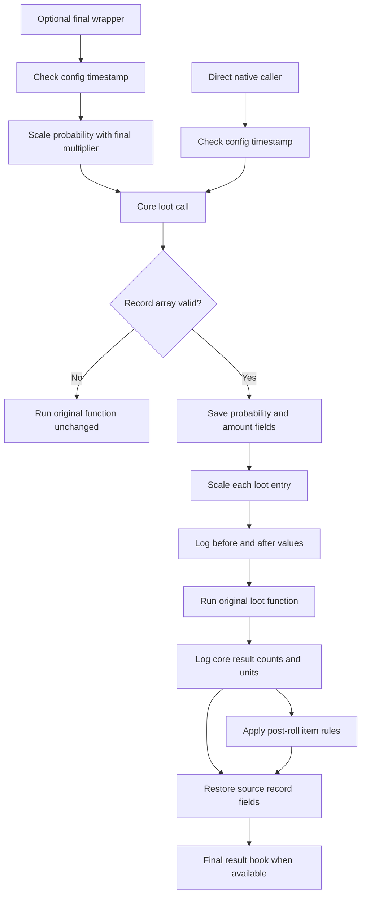

# Drop scaling

MoreDrops hooks the core native loot generator at `Wayfinder+0x1B12B40`.
This function performs the probability roll for the reflected wrapper and
direct native callers. A second hook at `Wayfinder+0x1B09200` applies the final
probability multiplier and records final `FWFLootResult` values.



## Scaling rules

The native hook uses these calculations for each entry:

```cpp
entry.probability = scaled_value(entry.probability, g_settings.core_probability);
entry.minimum = scaled_value(entry.minimum, g_settings.minimum);
entry.maximum = scaled_value(entry.maximum, g_settings.maximum);
if (entry.maximum < entry.minimum) entry.maximum = entry.minimum;
```

The final wrapper hook uses this calculation before it calls the core hook:

```cpp
entry.probability = scaled_value(entry.probability, g_settings.final_probability);
```

A final wrapper call uses both probability multipliers. A direct core call
uses only `CoreProbabilityMultiplier`.

The input `FWFLootTableRecord` is a shared data-table record. Each hook saves
its changed scalar fields, calls the original function, and restores the
fields. This contract prevents multipliers from accumulating across calls. A
recursive mutex protects the temporary change from concurrent loot calls.

## Runtime contract

- `FWFLootTableRecord::Loot` starts at offset `0x08`.
- Each `FWFLootTableRecordEntry` has size `0x130`.
- `Probability`, `MinAmount`, and `MaxAmount` use offsets `0x00`, `0x30`, and `0x34`.
- The core result uses the reflected `FWFLootResultManifest` layout with size `0x50`.
- The final result uses the reflected `FWFLootResult` layout with size `0x70`.
- Both hooks use the Wayfinder x64 ABI: result pointer, record, source, and context.
- Each target requires a matching 24-byte function prologue before MinHook is enabled.
- A build-signature mismatch disables scaling and writes an explicit error.
- The native log records up to 40 entry changes for each hook.
- The native log records up to 200 core and final results per game start.
- The Lua script records up to ten calls for each selected gameplay stage.
- Both hooks check the configuration timestamp before scaling, but no more than once per second.
- A changed configuration applies to the valid loot call that performs the next timestamp check.
- The shared recursive mutex prevents a loot call from observing a partial settings reload.
- A combined probability multiplier greater than `100.0` writes a workload warning.

The reload path parses into a temporary settings object before it replaces the
active object:

```cpp
Settings next = g_settings;
next.item_probabilities.clear();
g_settings = std::move(next);
```

## Diagnostics

The installed native log is
`Mods/MoreDrops/MoreDropsNative.log`. An entry line proves that the generator
received scaled values:

```text
[MoreDropsNative] Core Entry diagnostic call=1 entry=0 probability=0.1->1 minimum=1->5 maximum=1->10
```

A final entry line proves that the final wrapper applied its separate value:

```text
[MoreDropsNative] Final Entry diagnostic call=1 entry=0 probability=0.05->0.1 minimum=1->1 maximum=1->1
```

A reload line proves that the native DLL accepted a saved configuration:

```text
[MoreDropsNative] Config reloaded core_probability=2.00 final_probability=1.00 minimum=1.00 maximum=1.00 item_probability_rules=1 echo_rarities_requested=All echo_filter=active path=...
```

An excessive combined probability value produces this warning:

```text
[MoreDropsNative] High loot workload warning combined_probability_multiplier=10000.00 Reduce CoreProbabilityMultiplier or FinalProbabilityMultiplier
```

A core result line reports the generated manifest arrays after the probability
roll finishes:

```text
[MoreDropsNative] Core result diagnostic call=1 source=0x... entries=3 changed=3 manifest_items=1 manifest_item_units=5 manifest_pickup_items=2 manifest_pickup_units=20 manifest_faux_items=0 manifest_faux_units=0 manifest_pickups=0
```

The final result hook records `Result diagnostic` lines for calls that return a
complete `FWFLootResult`.

`UE4SS.log` contains the bounded Lua gameplay-stage traces:

```text
[MoreDrops] Loot trace event=resource-grant count=1 context=...
```

Related: [Loot summary](summary.md), [Item filtering](item-filtering.md),
[Runtime reflection](../runtime/reflection.md), and
[Project practices](../practices.md).
