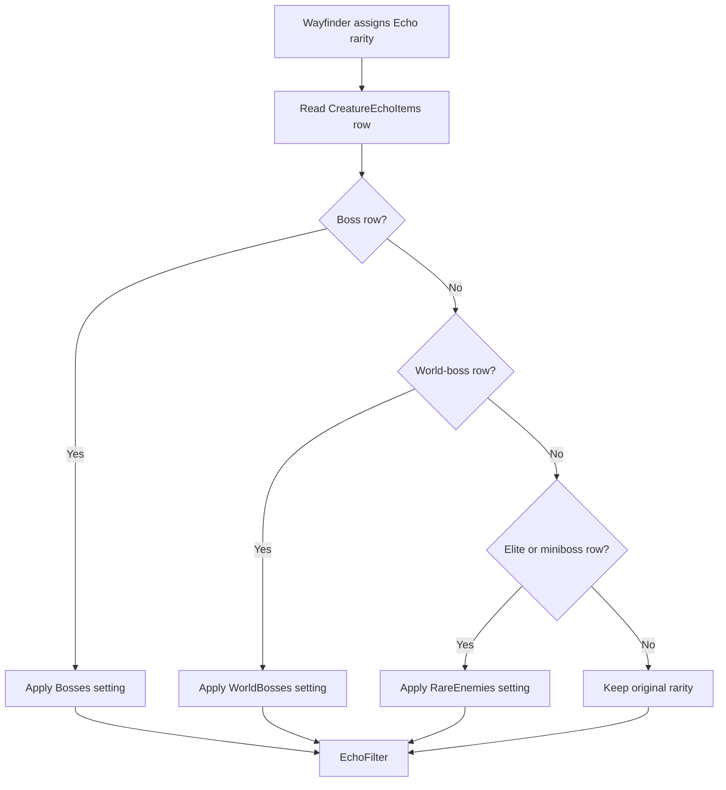

# Echo rarity overrides

MoreDrops can change Echoes from bosses, world bosses, and rare enemies to
Epic before the authoritative Echo rarity filter checks them. Classification
uses exact `CreatureEchoItems` row names extracted from Wayfinder resources.
It does not depend on a short-lived loot call context.



## Configuration contract

Each setting accepts `Original` or `Epic`. All settings default to `Original`.
The configuration reloads with the other MoreDrops settings.

```ini
[EchoRarityOverride]
Bosses=Original
WorldBosses=Original
RareEnemies=Original
```

`Epic` changes a matching Echo rarity to purple Epic. `Original` keeps the
rarity that Wayfinder assigned.

The groups have this priority when a row appears in more than one group:

```text
Bosses -> WorldBosses -> RareEnemies
```

## Resource classification

The boss group contains 57 exact Echo rows reached by the 50 current boss
chest contexts. The contexts contain both `CreatureEcho` and `CosmeticSet`
loot variables. Nested boss Echo sets are expanded into their exact item rows.

The world-boss group contains the three direct Echo rows used by current
overland miniboss settings:

```text
AncientReaverWarbearEcho
BoneCrusherYetiEcho
HowlerWolfEcho
```

The rare-enemy group contains 102 distinct Echo rows used by 121 resource
assets classified as elite or miniboss. The classifier includes Wayfinder
assets with `AI.EnemyClass.Elite`, `AI.EnemyClass.Miniboss`, an elite loot
schema, or a miniboss loot schema. The world-boss rows are kept in their
separate group.

For example, `GrimMorningstarEcho` is a rare-enemy row because its source uses
`AI.EnemyClass.Elite` and `Schema_Elite_Named`.

```cpp
if (group_setting == EchoRarityOverride::Epic) {
    temporary_echo.echo_rarity = 4;
}
```

## Filter authority and stability

`EchoFilter` remains authoritative. A forced Epic Echo is still rejected when
Epic is not in `AllowedRarities`. An `ItemProbability` value of `0` also keeps
blocking the matching item.

The override writes only the verified temporary Echo rarity byte. It fails
open when the item, row name, or target memory is not verified. A diagnostic
reports the matched group, original rarity, and Epic result.

The exact row lists are build-specific resource data. A Wayfinder update can
add new rows. Unknown rows keep their original rarity until the extracted
classifier is updated.

Related: [Boss unique drops](boss-unique-drops.md),
[Item filtering](item-filtering.md), and [Loot summary](summary.md).
