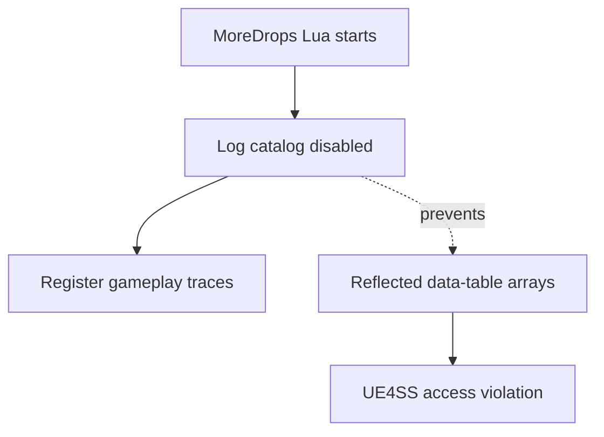

# Item catalog

MoreDrops does not build `ItemCatalog.tsv`. The reflected scan is disabled
because it is unsafe with the installed UE4SS build.



## File contract

The catalog contains one row for each loaded inventory item definition:

```text
DisplayName<TAB>ItemKey<TAB>RowName<TAB>DataTable<TAB>ObjectPath
Training Dummy<TAB>DataTableName:ItemRowName<TAB>ItemRowName<TAB>DataTableName<TAB>/Game/Data/Inventory/...
```

`ItemKey` is the stable configuration value. `DisplayName` is a localized
lookup value and can contain duplicate names.

## Runtime contract

- MoreDrops does not call `NotifyOnNewObject` for data tables.
- MoreDrops does not schedule a delayed data-table scan.
- MoreDrops does not call reflected data-table array functions from Lua.
- Loot scaling, item filtering, Echo filtering, and gameplay traces remain active.
- `Item diagnostic` lines provide stable keys for observed loot items.
- The log states that the item catalog is disabled.

## Current limitation

`GetDataTableRowNames` and `GetDataTableColumnAsString` return reflected array
data. UE4SS crashed while it converted this data for Lua. The dump reports a
read from `0x93` at `UE4SS+0x9BD02A`.

```text
Unhandled Exception: EXCEPTION_ACCESS_VIOLATION reading address 0x0000000000000093
UE4SS+0x9BD02A
```

The failing stack contains UE4SS and Wayfinder frames. It contains no
MoreDrops native DLL frame. The Lua catalog scan remains disabled until a
replacement uses safe direct data-table access.

The disabled scan used the reflected data-table library:

```lua
local row_names = {}
data_table_library:GetDataTableRowNames(data_table, row_names)
local display_names = data_table_library:GetDataTableColumnAsString(
    data_table,
    FName("DisplayName")
)
```

The current Lua script reports the disabled state:

```lua
print("[MoreDrops] Item catalog disabled; UE4SS reflected array conversion is unsafe")
```

The replacement must not pass reflected output arrays through the UE4SS Lua
bridge. A native reader or offline resource extractor can provide the catalog.

Related: [Loot summary](summary.md), [Item filtering](item-filtering.md), and
[Runtime reflection](../runtime/reflection.md).
