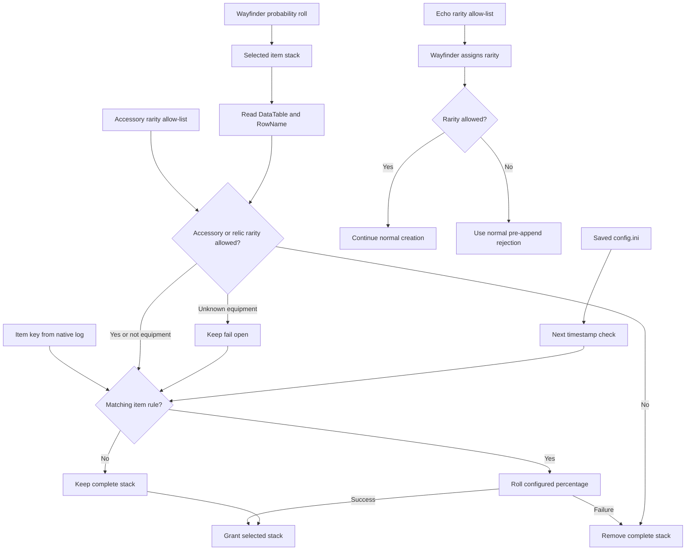
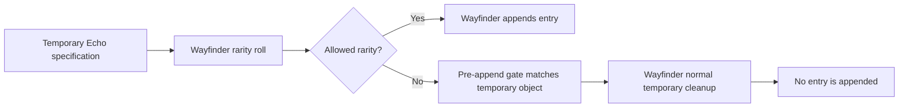

# Item filtering

MoreDrops identifies selected inventory items with their
`DataTable:RowName` item key. An item probability rule decides whether the
complete selected stack remains in the result manifest. The accessory rarity
allow-list removes disallowed accessory and relic equipment from the same
manifest. The Echo rarity allow-list rejects a disallowed Echo through
Wayfinder's normal temporary-item cleanup path before the inventory entry is
appended.



## Configuration contract

The `[ItemProbability]` section accepts percentages from `0` through `100`.
The value is an absolute post-roll percentage.

```ini
[ItemProbability]
DataTableName:ItemRowName=0
ItemRowName=25
```

The first rule blocks the exact item key. The second rule keeps approximately
25% of matching stacks from any data table. Full keys take priority over
row-only keys. Matching ignores letter case.

One roll applies to one `FInventoryItemCreationParams` stack. A stack with an
amount of `20` is kept as `20` or removed as `20`.

The `[EchoFilter]` section accepts an exact comma-separated allow-list.

```ini
[EchoFilter]
AllowedRarities=Epic
```

This value keeps only purple Epic Echoes. `Rare` means blue, and `Epic` means
purple. `All` keeps all assigned rarities. `None` rejects all assigned
rarities. The log reports the current value as `echo_rarities_requested`.

The `[AccessoryFilter]` section accepts the same allow-list values.

```ini
[AccessoryFilter]
AllowedRarities=Epic
```

This value keeps only purple Epic accessory and relic equipment. It does not
filter `RecipeItem_` rows. An item probability rule and the accessory filter
must both allow an item when both rules apply.

The `[EchoRarityOverride]` section can change exact boss, world-boss, elite,
and miniboss Echo rows to Epic before the Echo filter checks them.

```ini
[EchoRarityOverride]
Bosses=Epic
WorldBosses=Epic
RareEnemies=Epic
```

Each key also accepts `Original`. The Echo filter remains authoritative after
an override.

## Runtime contract

- The core hook filters `Items`, `ItemsAsPickups`, and `ItemsAsFauxjectiles`.
- The filter runs once for the outer core call and not for nested loot tables.
- The filter runs after Wayfinder selects items and before Wayfinder grants them.
- The filter does not change actor-only entries in the `Pickups` array.
- A missing rule keeps the item unchanged.
- A value of `0` always removes the selected stack.
- A value of `100` always keeps the selected stack.
- Removing a rule from the saved file removes it from the active rule map after reload.
- An invalid value keeps the previous value for the same key when one exists.
- Item rules reload before filtering on the valid loot call that detects the change.
- `FName::ToString` uses `Wayfinder+0x1F08B30` after a signature check.
- Name conversion reuses one thread-local game-allocated `FString` buffer.
- An item-name signature mismatch disables item rules but preserves global scaling.
- MoreDrops does not move or destroy an `FInventoryItemEntry` value.
- `Wayfinder+0x178C0F0` assigns rarity to the temporary Echo specification.
- `Wayfinder+0x177E1A0` is the guarded gate before the output count changes.
- `Wayfinder+0x177E38D` is the normal temporary cleanup branch.
- A disallowed Echo gate matches the temporary object recorded by the rarity hook.
- Wayfinder then follows its existing exit and destroys its temporary specification.
- The Echo hooks act only during a synchronous central loot-spawn call.
- An unknown rarity or unverified call path keeps the Echo.
- An Echo hook signature mismatch disables only Echo filtering.
- An item probability rule can block an Echo item key regardless of rarity.
- The accessory filter checks only `AccessoryInventoryItems` rows that start
  with `Accessory_` or `Relic_`.
- The current Wayfinder table contains 373 accessory rows, 149 relic rows, and
  two recipe rows.
- The accessory and relic row suffix identifies Common, Uncommon, Rare, or
  Epic rarity. Three `Accessory_TalentTester` rows have an explicit Rare map.
- The current classifier matches all 522 accessory and relic rows in the
  extracted Wayfinder resource.
- An unknown accessory or relic row stays in the result and logs
  `kept-fail-open`.
- Crafting, purchases, and item grants outside loot spawning remain unchanged.

## Stability contract

Version 0.12.0 does not compact generated `FInventoryItemEntry` arrays. Version
0.8.0 moved owned entries and destroyed rejected entry specifications after
creation. The current Echo filter records the roll on a temporary specification
and uses a normal Wayfinder rejection branch before the append.



The hook pair validates the rarity function, rarity caller, append gate, and
cleanup branch byte signatures. It enables both optional hooks as one queued
MinHook batch. A mismatch or installation failure keeps all Echoes and leaves
global scaling and item rules active.

Optional item-metadata branches can skip the earlier inventory lookup. All
main inventory entries converge at the append gate. The gate therefore matches
the temporary object directly before the output count changes.

## Diagnostics and item keys

`MoreDropsNative.log` records selected items and filter actions:

```text
[MoreDropsNative] Item diagnostic call=1 destination=inventory item_key=DataTableName:ItemRowName amount=20 level=1 item_probability=0.00 action=removed
[MoreDropsNative] Accessory diagnostic call=1 destination=inventory item_key=AccessoryInventoryItems:Accessory_Name_Rare1 amount=1 level=1 rarity=Rare allowed_rarities=Epic action=removed
[MoreDropsNative] Accessory filter diagnostic call=1 examined=1 removed=1 unknown=0 allowed_rarities=Epic
[MoreDropsNative] Echo roll diagnostic call=1 item_key=DataTableName:ItemRowName rarity=Rare allowed_rarities=Epic decision=reject-pending
[MoreDropsNative] Echo filter diagnostic call=1 item_key=DataTableName:ItemRowName rarity=Rare action=rejected-before-append
[MoreDropsNative] Echo rarity override diagnostic call=2 item_key=CreatureEchoItems:GrimMorningstarEcho group=RareEnemies rolled_rarity=Rare forced_rarity=Epic action=forced
```

The unsafe `ItemCatalog.tsv` Lua scan is disabled. Copy `item_key` from an
`Item diagnostic` line after Wayfinder selects the item.

The reload log reports the number of accepted item rules:

```text
[MoreDropsNative] Config reloaded core_probability=2.00 final_probability=1.00 minimum=1.00 maximum=1.00 item_probability_rules=2 echo_rarities_requested=Epic echo_filter=active accessory_rarities=Epic path=...
```

Related: [Loot summary](summary.md),
[Echo rarity overrides](echo-rarity-overrides.md), [Drop scaling](drop-scaling.md),
and [Item catalog](item-catalog.md).
