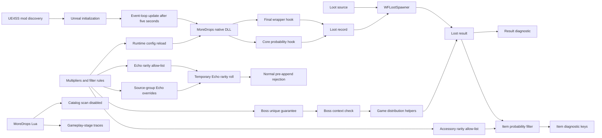

# Loot summary

MoreDrops changes loot records before Wayfinder generates loot. The mod has
independent core probability, final probability, minimum amount, and maximum
amount multipliers. Post-roll rules can block selected item stacks. Version
0.12.0 can expand eligible boss-specific unique pools. It rejects disallowed
accessory and relic rarities in the item manifest. It rejects disallowed Echo
rarities before inventory entries are appended. Resource-backed settings can
change boss, world-boss, elite, and miniboss Echoes to Epic before the Echo
filter runs.



## Contract

- `CoreProbabilityMultiplier` defaults to `2.0`.
- `FinalProbabilityMultiplier` defaults to `1.0`.
- `MinAmountMultiplier` defaults to `1.0`.
- `MaxAmountMultiplier` defaults to `1.0`.
- Each multiplier supports values from `1.0` through `100.0`.
- Each item probability supports values from `0` through `100`.
- An item probability applies to one complete selected item stack.
- The filter checks a full item key before it checks a row-only key.
- The Lua item-catalog scan is disabled because UE4SS reflected array conversion crashes.
- Item diagnostics provide stable keys for observed loot items.
- The Echo rarity setting accepts `Common`, `Uncommon`, `Rare`, and `Epic`.
- The native log reports the requested Echo rarity value.
- Version 0.10.0 applies the Echo allow-list during synchronous central loot spawning.
- Rare Echoes are blue. Epic Echoes are purple.
- A disallowed Echo follows Wayfinder's normal temporary-item cleanup path.
- Echo filtering fails open when a rarity, call path, or hook signature is not verified.
- MoreDrops does not compact or destroy generated inventory entries.
- The accessory rarity setting accepts `Common`, `Uncommon`, `Rare`, and `Epic`.
- The accessory filter applies only to `Accessory_` and `Relic_` rows in
  `AccessoryInventoryItems`.
- Accessory recipe rows bypass the accessory filter.
- An unknown accessory or relic row fails open.
- `DropAllUniques` defaults to `false`.
- `Bosses`, `WorldBosses`, and `RareEnemies` Echo overrides default to
  `Original` and also accept `Epic`.
- The boss rule recognizes all 50 current boss-chest contexts through their
  `CreatureEcho` and `CosmeticSet` variables.
- The boss rule expands only eligible boss-specific unique pools.
- Shared currency, spectra, gloomstone, summoning stones, and quest items keep
  their normal behavior.
- Echo override groups use exact `CreatureEchoItems` rows extracted from
  Wayfinder resources.
- The rare-enemy group covers all current elite and miniboss assets, except
  overland world bosses kept in their separate group.
- The Echo rarity allow-list checks the forced Epic result.
- Item probability and rarity filters remain authoritative after expansion.
- A distribution helper signature mismatch disables only the boss rule.
- MoreDrops checks `config.ini` before valid loot calls, but no more than once per second.
- A successful reload applies one complete settings object before scaling and filtering.
- A missing or unreadable configuration leaves the active settings unchanged.
- The mod changes loot processed by all callers of the core `WFLootSpawner` generator.
- The mod does not change item identities or loot distribution types.
- The mod raises a scaled maximum when it is less than the scaled minimum.
- The native hook restores source record values after each synchronous loot call.
- The mod logs the first 40 changed loot entries for each native hook.
- The mod logs result counts and item units for the first 200 loot calls.
- The mod logs the first 1,000 selected item results.
- The mod logs the first 1,000 Echo rarity rolls.
- The mod logs the first ten calls for each selected gameplay loot stage.
- Every native hook target requires a matching Wayfinder build signature.
- Native hook installation runs from the event loop five seconds after Unreal
  initialization and after UE4SS finishes `enabled.txt` mod discovery.

## Configuration example

```ini
[General]
CoreProbabilityMultiplier=2.0
FinalProbabilityMultiplier=1.0
MinAmountMultiplier=1.0
MaxAmountMultiplier=1.0

[ItemProbability]
DataTableName:ItemRowName=0

[EchoFilter]
AllowedRarities=All

[AccessoryFilter]
AllowedRarities=Epic

[BossDrops]
DropAllUniques=false

[EchoRarityOverride]
Bosses=Original
WorldBosses=Original
RareEnemies=Original
```

A successful runtime update has this form:

```text
[MoreDropsNative] Config reloaded core_probability=2.00 final_probability=1.00 minimum=1.00 maximum=1.00 item_probability_rules=1 echo_rarities_requested=All echo_filter=active accessory_rarities=Epic boss_drop_all_uniques=false echo_override_bosses=Original echo_override_world_bosses=Original echo_override_rare_enemies=Original boss_drop_hooks=active path=...
```

Related: [Drop scaling](drop-scaling.md), [Item filtering](item-filtering.md),
[Boss unique drops](boss-unique-drops.md),
[Echo rarity overrides](echo-rarity-overrides.md), [Item catalog](item-catalog.md),
[Runtime reflection](../runtime/reflection.md), and
[Build system](../distribution/build-system.md).
