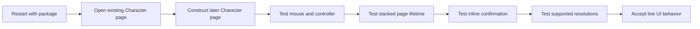

# Loadouts UI live validation plan

Live validation failed. Loadouts is a nonfunctional work in progress.
The interface can appear, but profile operations are incomplete and saving can crash Wayfinder.



## Test prerequisites

- Close Wayfinder before replacing `dlls/main.dll`.
- Install the complete package, including `Loadouts.pak` and both Lua files.
- Enable `BPModLoaderMod` and the Loadouts UE4SS mod.
- Keep `UE4SS.log` and `LoadoutsNative.log` for each failed test.

The Pak must use this installed path:

```text
Atlas/Content/Paks/LogicMods/Loadouts.pak
```

## Launcher discovery tests

- Start Loadouts while a Character Loadout page already exists.
- Confirm that the one startup scan adds one launcher.
- Open a new Character Loadout page after startup.
- Confirm that the exact Blueprint Construct hook adds one launcher.
- Reopen the page several times and confirm that no page receives duplicates.
- Confirm that every action uses the Wayfinder access-button art and focus behavior.
- Remove the access-button class and confirm that no inert UMG button appears.

## Input and focus tests

- Activate the launcher and each page action once with a mouse.
- Repeat each action with controller confirm.
- Verify explicit directional navigation through actions and profile rows.
- Refresh the list and confirm that controller focus returns to a valid action.
- Use controller Back and Escape repeatedly without closing the Character page.
- Close the viewport fallback and confirm that prior focus or game input returns.

## Page lifetime tests

- Open Loadouts through the Airship menu manager.
- Put another page above Loadouts and confirm that Loadouts remains in the stack.
- Verify that Loadouts ignores page input while it is not the top page.
- Return to Loadouts and confirm that its controls and focus still work.
- Remove Loadouts from the stack and confirm that stale state releases once.
- Repeat after world travel and a character change.

## Confirmation panel tests

- Apply a profile with an unavailable part.
- Confirm that the inline panel disables profile actions.
- Cancel and verify that no loadout part changes.
- Confirm and verify that only safe sections apply.
- Change conditions before confirmation and verify that the panel updates.
- Close the page while confirmation is pending and verify automatic cancellation.

## Display tests

- Verify layout at 1280x720.
- Verify layout at 1920x1080.
- Verify layout at 2560x1440.
- Verify layout at 3840x2160.
- Confirm readable warning text with the longest supported profile name.

## Package fallback tests

- Remove `Loadouts.pak` and confirm that console commands still work.
- Disable `EnableLoadoutUi` and confirm that profile shortcuts still work.
- Replace the native DLL only after exit, then confirm behavior after restart.
- Confirm one `ProcessEvent relay registered` message for the game process.
- Confirm that no async construction or stale queued event crashes the game.

Related: [Loadouts service plan](loadouts.md),
[Loadouts interface](../loadouts/ui.md), [Loadouts summary](../loadouts/summary.md),
and [Build system](../distribution/build-system.md).
