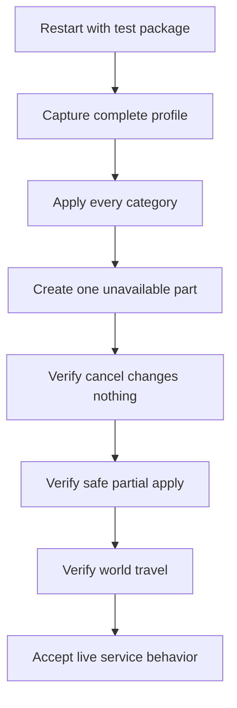

# Loadouts live validation plan

Live validation failed. Loadouts is a nonfunctional work in progress, and saving can crash Wayfinder.
Do not distribute the current package for use. Further work must identify the remaining runtime defects.



## Test prerequisites

- Close Wayfinder before each native package replacement.
- Preserve the existing `loadouts.db` and `loadouts.db.bak` before migration tests.
- Use a playable character with known equipment, Echoes, styles, talents, and abilities.
- Keep `UE4SS.log` and `LoadoutsNative.log` for each failed test.

## Database tests

- Load a version 1 test database and confirm that its profiles require recapture.
- Load a version 2 test database and confirm that reset-sensitive sections remain unchanged.
- Overwrite each migrated profile and confirm that schema version 3 stores trusted sections.
- Save, overwrite, rename, and delete profiles, then restart and verify persistence.
- Force a safe write failure and confirm that in-memory profiles remain unchanged.
- Confirm that a validated replacement leaves the prior file at `loadouts.db.bak`.
- Remove the live test file and confirm that a valid temporary file restores first.
- Use an invalid temporary file and confirm that a valid backup restores second.
- Confirm that each invalid recovery candidate is ignored and logged.

## Capture and complete apply

- Match every current-loadout item to the expected equipment-slot name.
- Confirm that the Character item supplies the Wayfinder group name.
- Confirm that duplicate inventory GUIDs select the correct item instances.
- Capture empty and populated Echo, dye, talent, node, style, and ability sections.
- Apply each category and verify zero-based Echo and ability positions.
- Change characters and confirm that deferred node validation uses the target character.

## Reset-safety tests

- Remove one saved Echo and confirm that its holder keeps the current Echo set.
- Remove one saved dye and confirm that its holder keeps the current dye set.
- Make one saved talent unavailable and confirm that only its holder or pool remains unchanged.
- Make one style unavailable and confirm that the complete affected style set remains unchanged.
- Make one archetype node invalid and confirm that the complete tree remains unchanged.
- Apply trusted empty sections and confirm that only their intended reset units clear.

## Confirmation tests

Use these console commands for the non-UMG path:

```text
LoadoutApply "Validation Profile"
LoadoutCancel
LoadoutApply "Validation Profile"
LoadoutConfirm
```

- Confirm that Cancel changes no profile part.
- Change inventory state after the first warning, then confirm once.
- Verify that the changed warning requires another confirmation and applies nothing.
- Confirm again and verify that available parts apply while blocked reset units remain unchanged.
- Start a second apply while confirmation is pending and verify its rejection.

## Stability tests

- Apply after world travel and after a character change.
- Start a newer apply during delayed work and verify that older work stops.
- Restart Wayfinder after a native DLL upgrade and verify one callback registration.
- Confirm that no service operation crashes UE4SS or the game.

Related: [Current roadmap](roadmap.md), [Loadouts service](../loadouts/service.md),
[Loadouts UI plan](loadouts-umg-pak.md), and
[Loadouts summary](../loadouts/summary.md).
