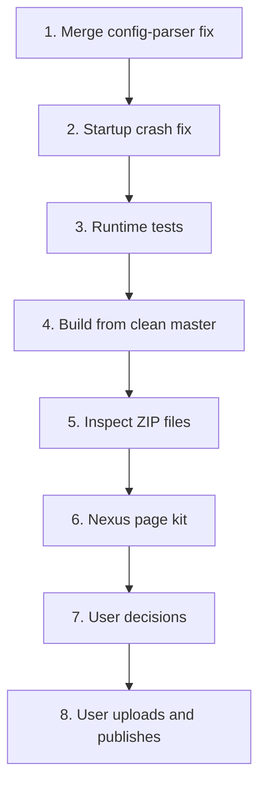

# Nexus Mods release plan

The first Nexus Mods release contains MorePlayers and SkipStartupWarnings.
Loadouts is excluded because it is nonfunctional. MoreDrops is deferred.
The user uploads and publishes. The repository prepares packages and page
text.

## Steps

1. Port the config-parser fix onto `master`. The native and Lua parsers then
   accept the same `MaxPlayers` lines, and the last valid line wins.
2. Remove the MinHook startup activation from the normal MorePlayers path.
   See [Startup crash fix](#startup-crash-fix).
3. Test a solo start, a Steam friends list `Join Game`, and a Steam overlay
   invite with a real friend.
4. Build both packages with `build.ps1 -Mod MorePlayers,SkipStartupWarnings`
   in a clean worktree of `master`.
5. Inspect each ZIP:
   - no `source` folder and no Loadouts files;
   - the Wayfinder UE4SS signature file is present;
   - the packaged README is identical to the source README;
   - the MinHook license notice ships with `main.dll`.
6. Write the Nexus page kit for each mod: summary, BBCode description,
   requirements, install and uninstall steps, known issues, changelog, and
   file description.
7. Get the user's decisions on credit, permission, and version numbers.
8. The user creates the pages, uploads the ZIP files, and publishes.

## Startup crash fix

A crash dump from 2026-10-02 15:35 UTC shows a null execute fault in
`chrome_elf.dll`. The call came from `kernel32!Thread32Next` inside MinHook
`Freeze`, which `MH_ApplyQueued` calls. The return address `main.dll+0x97A9`
is in `install()`, which also references `Full-party hook not installed`. In
that build the batch held only the Steam hook. Build `5193CA08` had 1 crash in
7 starts.

When both instruction patch groups apply, each MinHook hook only passes values
through:

| Hook | Effect with both patches |
|---|---|
| `SetLobbyMemberLimit` | Logs `25 -> 25`, then publishes Steam rich presence |
| EOS session hooks | Log `25 -> 25` and diagnostics only |
| Full-party hook | Not installed |

The Steam hook's rich presence publish (`connect`, `steam_player_group`, and
`steam_player_group_size`) is the only effect that is not diagnostic. Static
analysis shows that the Steam OSS sets `connect` itself when
`bAllowJoinViaPresence` is true (`0x140ED0020`). A runtime check must confirm
this.

Design:

- When both patch groups apply, the DLL calls no `MH_ApplyQueued`. It
  installs neither the Steam batch nor the EOS batch.
- When a patch group fails, the DLL keeps the complete hook path as the
  fallback.
- The DLL reads the local user's own `connect`, `steam_player_group`, and
  `steam_player_group_size` rich presence through the Steam flat API on the
  update thread. It logs each change. This needs no hook.
- If `connect` stays empty while the host has a session, publish it through a
  path that needs no MinHook. Decide this after the runtime check.

One clean start proves only the structure: no applied batch and no `Hooked`
lines. A few clean starts cannot prove a 1-in-7 crash fixed.

## User decisions

- MorePlayers is released as **MorePlayersPlus**. The rename is complete: mod
  ID, source folder, install folder `Mods\MorePlayersPlus`, config path,
  archive name, page name, and log prefixes. A different install folder
  prevents file collisions with FuniWF's More Players mod.
- Both mods start at version **1.0.0**.
- FuniWF gave permission. The page credits FuniWF's More Players mod as the
  origin of the Lua session-limit approach.
- A user who installed an earlier MorePlayers build must delete
  `Mods\MorePlayers`. Two copies would apply the patches and hooks twice.

Related: [Roadmap](roadmap.md), [Distribution](../distribution/summary.md),
[Runtime stability](../runtime/stability.md), and
[Five-player session evidence](../runtime/five-player-session.md).
