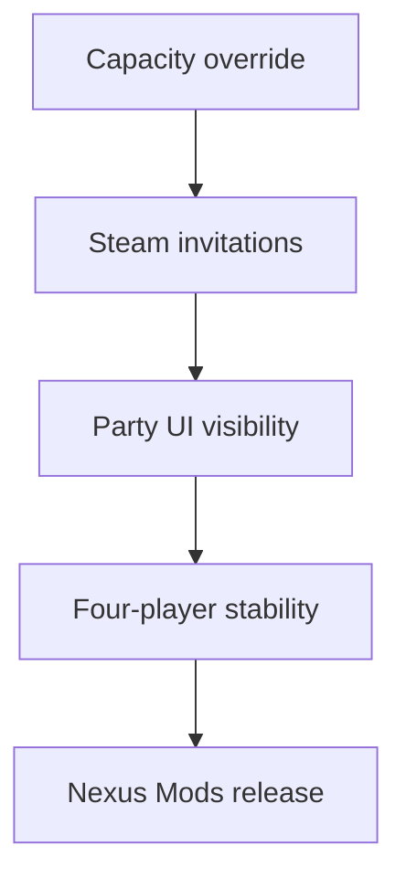

# Current roadmap

The current work focuses on reliable sessions with more than three players and
clear host-side diagnostics.



## Active work

- Record enough network data to diagnose client actor-channel failures.
- Test sessions with more than five players.

## Deferred work

- Add distribution targets for other mod hosting websites.
- Decide whether party UI changes must remain host-only.

## Validation example

```text
[MorePlayers] Party UI snapshot begin reason=AddPlayerState
```

Related: [Party UI](../runtime/party-ui.md), [Session capacity](../runtime/session-capacity.md), and [Distribution](../distribution/summary.md).
