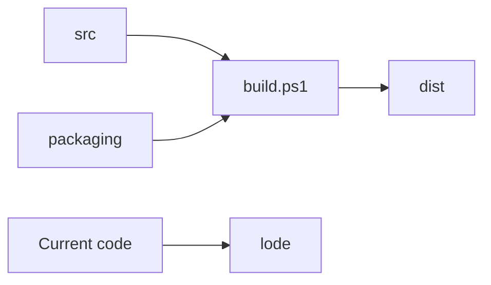

# Project practices

The project keeps editable inputs in `src`, hosting templates in `packaging`,
generated files in `dist`, and persistent project knowledge in `lode`.



## Invariants

- Treat code as the source of truth when code and Lode content differ.
- Update the related Lode file after each behavior or structure change.
- Keep session scraps in `lode/tmp`.
- Keep each Lode file focused and shorter than 250 lines.
- Use Mermaid for all Lode diagrams.
- Generate Markdown tables of contents with `scripts/update-toc.ps1`.
- Do not commit generated `dist` or `src/native/build` files.

## Build example

```powershell
.\build.ps1
```

## Documentation example

```powershell
.\scripts\update-toc.ps1
```

Related: [Lode map](lode-map.md), [Distribution](distribution/summary.md), and [Roadmap](plans/roadmap.md).
