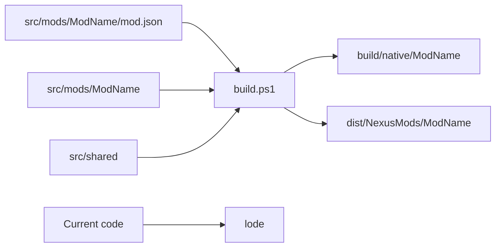

# Project practices

The project keeps mod sources in `src/mods` and shared inputs in `src/shared`.
It keeps generated native files and distribution files outside `src`.



## Invariants

- Treat code as the source of truth when code and Lode content differ.
- Update the related Lode file after each behavior or structure change.
- Keep session scraps in `lode/tmp`.
- Keep each Lode file focused and shorter than 250 lines.
- Use Mermaid for all Lode diagrams.
- Generate Markdown tables of contents with `scripts/update-toc.ps1`.
- Keep each mod's installable files in its `content` directory.
- Keep each optional CMake project in its `native` directory.
- Define each mod with `src/mods/<ModName>/mod.json`.
- Keep the mod catalog and cross-mod contributor guidance in the root README.
- Keep the current repository layout in the root README.
- Document the root build process and supported options in the root README.
- Keep complete mod documentation in `src/mods/<ModName>/README.md`.
- Copy each mod README into its generated package.
- Do not commit generated `build` or `dist` files.

## Build example

```powershell
.\build.ps1 -Mod MorePlayersPlus
```

## Documentation example

```powershell
.\scripts\update-toc.ps1
```

Related: [Lode map](lode-map.md), [Build system](distribution/build-system.md),
and [Distribution](distribution/summary.md).
