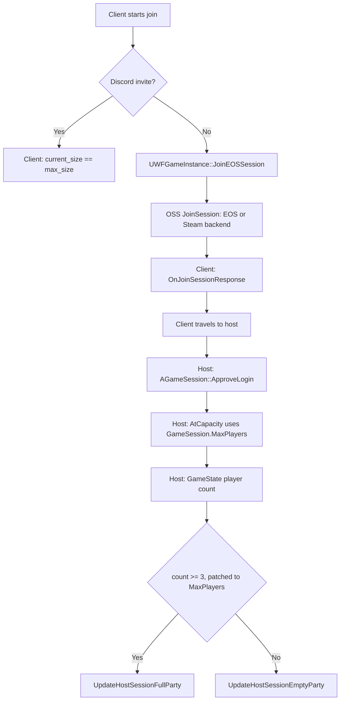

# Capacity checks in Wayfinder.exe

This file lists the player-capacity checks in `Wayfinder.exe`. Static analysis
found these checks in build `CHANGELISTNUMBER_SEARCH=211130`. The image base is
`0x140000000`.

The host and the client use the same binary. A check is client-side only when
the process of the joining player makes the decision.



## Host-side checks

| Address | Function | Check | Mod coverage |
|---|---|---|---|
| `0x1416EAF00` | `AWFGameModeBase::PreLogin` | Writes log lines and calls `AGameModeBase::PreLogin`. Has no capacity check. | Not necessary |
| `0x143965720` | `AGameSession::ApproveLogin` | Calls the virtual `AtCapacity` at vtable `+0x670`. Rejects the player with `Server full.` | Indirect |
| `0x143965F00` | `AGameSession::AtCapacity` | Compares `NumPlayers` with `MaxPlayers` at `+0x22C`. Uses `net.MaxPlayersOverride` when its value is more than 0. | Lua sets `MaxPlayers` |
| `0x143979FE0` | `AGameSession::InitOptions` | Writes the `?MaxPlayers=` URL option to `+0x22C`. | No travel URL contains this option |
| `0x141630660`, `0x14164D2B2` | Session refresh callers | `cmp [GameState+0x248], 3` selects the full or the empty publication. | Threshold patch sets `MaxPlayers` |
| `0x14164D770` | `UpdateHostSessionFullParty` | Disables join in progress and invites. The settings helper then enables advertisement and presence join again for a public session. | Runs at `MaxPlayers`. The fallback hook does nothing. |
| `0x14164D330` | `UpdateHostSessionEmptyParty` | Enables invites and join in progress. | Instruction patch sets the capacity |
| `0x14170A560` | Matchmaking backfill | Compares the player count with the `mcp.BackfillCap*` console variables. | Co-op joins do not use this check |

The four game-session vtables are `Engine`, `Airship`, `WF`, and `Mayhem`. Each
vtable uses the standard `ApproveLogin`, `AtCapacity`, and `InitOptions`.

No code writes a constant value to `GameSession.MaxPlayers`. The GameState
player count is at `+0x248`. Only the two full-or-empty selectors compare this
count with `3`.

The backfill limits apply to dedicated servers:

- Expedition: 8
- Town: 15
- High-population Overland: 8
- Low-population Overland: 6
- Raid: 24

## Local session settings

Wayfinder builds the hosted `FOnlineSessionSettings` (vtable `0x144B455E0`)
in four functions. Each original instruction writes the constant 3 to
`NumPublicConnections` (settings `+0x8`). The native DLL changes each
immediate value to `MaxPlayers`.

| Address | Function | Original bytes | Then calls |
|---|---|---|---|
| `0x1416309C2` | `UWFGameInstance::CreateHostPc` | `48 C7 45 F8 03 00 00 00` | `CreateSession` (vtable `+0x40`) |
| `0x14163110A` | Defunct-session update | `48 C7 45 88 03 00 00 00` | `UpdateSession` (`+0x98`), then `DestroySession` |
| `0x14164D64C` | `UpdateHostSessionEmptyParty` | `C7 45 A8 03 00 00 00` | `UpdateSession` (`+0x98`) |
| `0x14164DA61` | `UpdateHostSessionFullParty` | `C7 45 A8 03 00 00 00` | `UpdateSession` (`+0x98`) |

The two 64-bit stores also set `NumPrivateConnections` to 0. The settings
helper `0x141649820` only adds attributes. It does not write `+0x8` or `+0xC`.

EOS `UpdateSession` (`0x14125BE20`) copies settings `+0x8` to the named session
(`+0x30`) without a limit. The patched value thus becomes the host's local
`NumPublicConnections`. Other Wayfinder session updates reuse the live session
settings and keep the value.

The patch also gives the Steam lobby the correct limit at creation.
`CreateLobby` has no hook, so it received 3 before the patch.

The EOS and Steam hooks stay active. When Wayfinder submits `MaxPlayers`, the
hooks send the same value.

## Rich presence joinability

`UWFRichPresenceSubsystem::IsSessionJoinable` (`0x1418C15E0`) returns true
only when all of these conditions are true:

- The player count (`+0x70`) is less than the local `NumPublicConnections`.
- `bAllowJoinInProgress` is true.
- `SESSIONPERMISSIONLEVEL` is less than 2.

```text
mov eax, [rdx+30h]    ; Session.SessionSettings.NumPublicConnections
cmp [rcx+70h], eax    ; rich presence player count
jl  joinable
```

`TryConfigurePartyInfo` (`0x1418DF190`) calls this function through vtable
`+0x2B0`. When the result is false, the function clears the party ID (`+0x50`)
and the join secret (`+0x60`). The function always copies the local
`NumPublicConnections` to the party maximum (`+0x74`).

Only `UWFDiscordSubsystem` sends this party data out. With the patch, the
Discord party is joinable up to `MaxPlayers`, and its maximum is `MaxPlayers`.
Without the patch, both stop at 3. The Discord invite check on the client then
rejects the invite with `Party is full.`

The Steam OSS `connect` key (`0x140ED0020`) does not use the player count.
The Steam OSS sets the key when `bAllowJoinViaPresence` is true.

## Join paths

| Path | Client gate | Host gate | Capacity source |
|---|---|---|---|
| Discord | `current_size == max_size` | Rich presence joinability | Local `NumPublicConnections` |
| Steam invite or presence | None found | `AtCapacity`, Steam lobby limit | Lua `MaxPlayers`, local `NumPublicConnections` |
| Public browser or session code | None found | `AtCapacity`, EOS backend | Lua `MaxPlayers`, local `NumPublicConnections` |
| Pause menu `+Party Member` | Blueprint hides it at 3; Lua shows it below `MaxPlayers` | Steam overlay invite | Steam lobby limit |
| Social-list or chat Invite | DE client not logged in | None, no request sent | Not applicable |

The online subsystem is EOSPlus with Steam as the base. At runtime, the host's
named `GameSession` is a Steam lobby session (`SteamP2P`, `Type: Lobby
session`). Wayfinder also creates an EOS session with the same name. The Steam
lobby limit is therefore a possible join gate. The patch makes `CreateLobby`
and `SetLobbyMemberLimit` receive `MaxPlayers`.

The public session browser (`LobbyBrowser` gameplay feature) searches EOS
sessions. Its only capacity filter is `NumPublicConnections >= 1` (EOS
comparison 3). The host publishes `MaxPlayers`.

The Digital Extremes (MCP) backend is not connected in this build. At startup,
`LogMCP` reports `Server Time - 0001.01.01-00.00.00` and then `Logging out:
Server Connection Shutting Down`. The HTTP module has no requests. An in-game
social Invite wrote no game log line. A DE client call while logged out
writes an error line only when the target has a DE account ID. The
social-list and chat Invite call only `UDEClientConnection::SendPartyInvite`
(`0x14184F220`). Its `IsLoggedIn` check fails, so it sends no request.
`partySizeLimit` is only a server error code. No client or host code counts
party members for it. The MCP server connection is a local mock
(`UMCPServerConnectionMock`) and kicks no player.

The two full-party selectors are `83 BB 48 02 00 00 03` at `0x14163099A` and
`83 BF 48 02 00 00 03` at `0x14164D2EC`. The signed immediate byte is at `+6`.
The native DLL changes it to `MaxPlayers`. Below the limit, every session
refresh then runs `UpdateHostSessionEmptyParty` and publishes current
difficulty, power level, and character attributes. Only these two instructions
lead to `UpdateHostSessionFullParty`: a call at `0x1416309A4` and a jump at
`0x14164D30C`. No pointer or RIP-relative `lea` refers to the function.

The full-party suppression hook is the fallback when the selector patch does
not apply. A suppression hook drops every refresh at 3 or more players, so the
published attributes can then become stale.

The rich presence maximum (`+0x74`) is also set to 3 directly by
`OnTravelFinished` (`0x1418CE12F`). The next `TryConfigurePartyInfo` replaces
it with the session value.

The public browser shows at most three player portraits
(`UI_FoundSessionWidget`: `PlayerIcon`, `Player2Icon`, `Player3Icon`). This is
display data only.

Gameplay scaling reads the real `PlayerArray.Num` (`AWFGameState+0x248`):
encounter difficulty (`0x141659A50`) and enemy match scaling (`0x141B61F60`).
A false lower player count would scale the game for fewer players.

`OnRegisterPlayersCompleteResponse` decrements `NumOpenPublicConnections`
(session `+0xFC`) after the OSS already decremented it, without a lower limit.
The Steam OSS publishes the value as `NUMOPENPUBCONN`. No code was found that
blocks a join on this value.

## Client-side checks

| Address | Function | Check |
|---|---|---|
| `0x1412B4D20` | Discord `OnActivityInvite` | Rejects the invite when `party.size.current` equals `party.size.max` (`Party is full.`). |
| `0x14163F110` | `UWFGameInstance::OnJoinSessionResponse` | Shows `SessionIsFull_Body` only when the OSS returns `SessionIsFull`. |
| `0x141639F60` | `UWFGameInstance::JoinEOSSession` | Checks hardcore and difficulty mismatches only. Has no capacity check. |
| `0x14120DBE0` | EOS `JoinSession` callback | Returns `UnknownError` (5) for each EOS failure. |

The host publishes the values that the Discord check uses. The client does not
compare these values with a local constant.

No Steam or EOS join path compares the open slots of a search result with any
value. The only slot read is a copy of the search result.

```text
cmp dword ptr [rbx+248h], 3   ; GameState player count
jl  UpdateHostSessionEmptyParty
call UpdateHostSessionFullParty
```

## Analysis method

1. Extract the ASCII and UTF-16 strings with their file offsets.
2. Convert each `.rdata` offset with `VA = raw + 0x140000C00`.
3. Find the RIP-relative references to each string.
4. Use `.pdata` to find the function that contains each reference.
5. Disassemble each function with `dumpbin /disasm:nobytes /range:start,end`.

The analysis scripts are not kept in the repository.

To test the patch without the game, map the executable with
`LoadLibraryExW(path, nullptr, DONT_RESOLVE_DLL_REFERENCES)`. Then call
`patch_immediates(base, group, value)` for each group. This runs no game code.
Restore the page protection after each test step that corrupts a site.
Several sites share a page, so a changed protection affects later checks.

## Lessons learned

- A hook that changes only an outgoing call does not change the caller's
  state. Find each consumer of the original value before you select a hook.
- A REX.W store (`48 C7`) can set two adjacent fields. A scan for 32-bit
  `C7` stores does not find it.
- The executable has no RTTI. Identify classes through log strings and vtable
  slots.

Related: [Session capacity](session-capacity.md), [Runtime diagnostics](diagnostics.md),
and [Runtime summary](summary.md).
