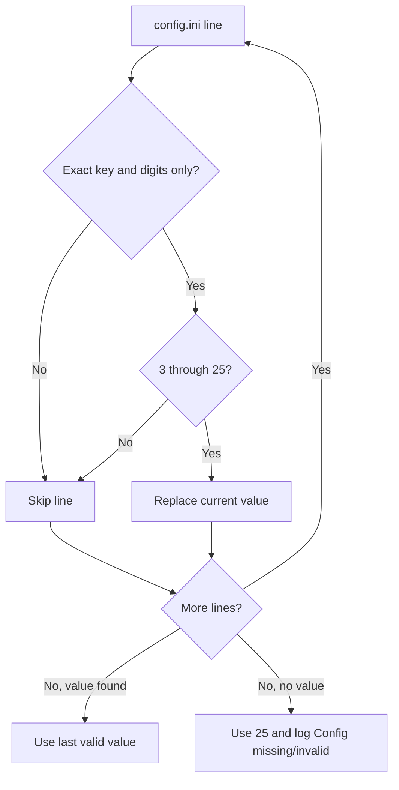

# Configuration parsing

Lua `load_max_players()` in `content/Scripts/main.lua` and native
`parse_max_players_line()` in `native/dllmain.cpp` accept the same `MaxPlayers`
lines. A mismatch gives Unreal one limit and EOS, Steam, and the instruction
patches a different limit. The smaller value then becomes the real session
capacity, and the party controls can show on a session that is already full.



## Contract

- The Lua pattern `^%s*MaxPlayers%s*=%s*(%d+)%s*$` is the reference rule.
- The key is exact and case-sensitive. A comment line or a different key never
  matches.
- The value contains only digits. A sign, a decimal point, or trailing text
  makes the line invalid.
- Both parsers skip an invalid or out-of-range line. They do not clamp the
  value.
- The last valid line wins in both parsers.
- If no line is valid, both parsers use 25 and keep their existing
  `Config missing/invalid` log messages.
- Native whitespace is the C-locale `isspace` set: space, `\t`, `\n`, `\v`,
  `\f`, and `\r`. Lua `%s` uses the same set.
- The native digit loop keeps the value at 26 or less. A long digit string
  cannot overflow, and the range check rejects 26.
- A UTF-8 BOM before a first-line `MaxPlayers` key makes that line invalid in
  both parsers.

## Example

```text
# MaxPlayers=8 example   skipped: comment line
MaxPlayers=10 # note     skipped: trailing text
MaxPlayers=30            skipped: out of range
MaxPlayers=12            valid: the limit is 12 in Lua and native code
```

```cpp
// The last valid line wins, as in the Lua parser.
while (std::getline(file, line))
    if (const auto value = parse_max_players_line(line)) configured = value;
```

## Lessons learned

Change both parsers together. Do not use a substring key search or `std::stoi`
for this value. A substring search accepts comment lines and other keys, and
`std::stoi` accepts trailing text. Before you release a parser change, read the
same configuration files with both parsers and compare the results.

Related: [Session capacity](session-capacity.md),
[Runtime summary](summary.md), and [Party UI](party-ui.md).
