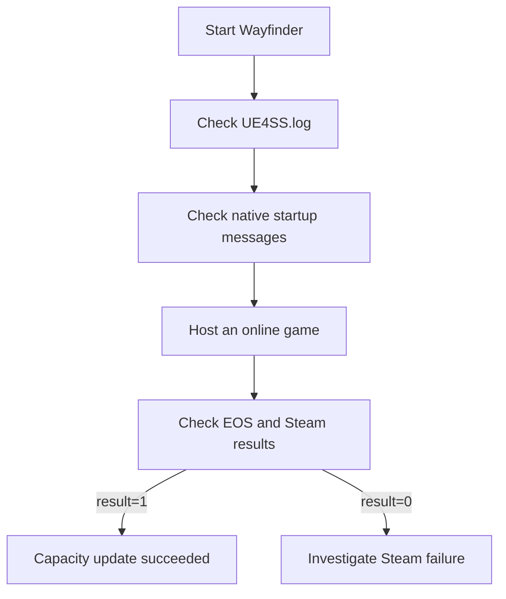

# Runtime diagnostics

Verification has two stages. Startup messages prove that UE4SS loaded both mod
components. Session messages prove that EOS and Steam accepted capacity updates.



## Startup contract

- `UE4SS.log` contains the configured limit and `Mod loaded`.
- `MorePlayersSteamLimit.log` contains `Native companion starting`.
- The native log confirms that EOS capacity hooks are enabled.

## Session contract

- EOS advertises `NumPublicConnections` with the configured limit.
- Steam receives `SetLobbyMemberLimit` with the configured limit.
- `SetLobbyMemberLimit result=1` indicates success.
- Steam messages appear only after the host creates a game session.
- Repeated original-limit replacements are expected session updates.

## Example

```text
[MorePlayersSteamLimit] EOS advertised NumPublicConnections 3 -> 25
[MorePlayersSteamLimit] SetLobbyMemberLimit result=1
```

## Crash evidence

Host and client crash evidence is stored under
`%LOCALAPPDATA%/Wayfinder/Saved`. A client crash must be diagnosed with files
from that client's computer.

Related: [Runtime summary](summary.md), [Session capacity](session-capacity.md), and [Party UI](party-ui.md).
