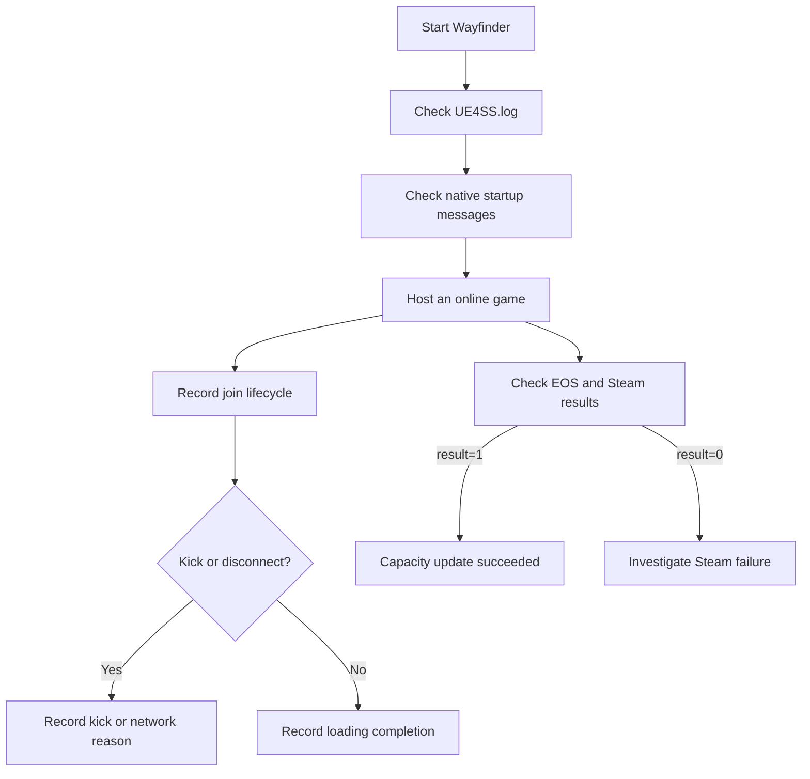

# Runtime diagnostics

Verification has two stages. Startup messages prove that UE4SS loaded both mod
components. Session messages prove that EOS and Steam accepted capacity updates.



## Startup contract

- `UE4SS.log` contains the configured limit and `Mod loaded`.
- `MorePlayersSteamLimit.log` contains `Native companion starting`.
- The native log confirms that EOS capacity hooks are enabled.
- The native log contains `Session capacity patch applied at 4 sites`.
- The native log contains `Full-party threshold patch applied at 2 sites` and
  `Full-party hook not installed`. If the threshold patch does not apply, the
  log confirms that the full-party fallback hook is enabled.
- `UE4SS.log` contains `Party invite controls hook ready`.
- `build signature mismatch` means the DLL left the full-party hook disabled,
  or changed no instruction in that patch group.

## Session contract

- EOS advertises `NumPublicConnections` with the configured limit.
- Steam receives `SetLobbyMemberLimit` with the configured limit.
- `SetLobbyMemberLimit result=1` indicates success.
- Steam messages appear only after the host creates a game session.
- Repeated original-limit replacements are expected session updates.
- With the threshold patch, no `Suppressed UWFGameInstance::UpdateHostSessionFullParty`
  line appears. That line appears only with the fallback hook.
- `Party invite controls players=N limit=M result=shown` confirms that the host
  pause menu shows `+Party Member` and `Code` at N players.
- `session-settings-publication`, `party-created-or-joined-publication`, and
  `party-update-publication` confirm that the configured online-party maximum
  was applied before Wayfinder published the corresponding state.

## Join diagnostics

Lua records low-volume join lifecycle events in `UE4SS.log`. These hooks do
not change function parameters or return values.

- `post-login` records a controller accepted by the game mode.
- `anti-cheat-register` records the start of player authentication.
- `client-loading-complete` records completed client world loading.
- `player-count-changed` records Wayfinder's observed player count.
- `party-refresh` records the party component's observed member count.
- `client-kicked` and `hardcore-client-kicked` record the supplied reason.
- `lobby-beacon-client-kicked` records rejection before normal player login.
- `lobby-beacon-login` and `lobby-beacon-login-complete` record beacon login.
- `party-reservation-response` records the reservation result code.
- `party-reservation-full` records a full-reservation notification.
- `joinability-settings` records old and new limits, invite permission, and
  presence-join permission.
- `joinability-update-failed` records an inaccessible parameter buffer.
- `logout` records removal of a controller from the game mode.
- `network-error` and `travel-error` record local host failures.

The sequence number preserves event order when several events have the same
UE4SS timestamp.

## Example

```text
[MorePlayersSteamLimit] EOS advertised NumPublicConnections 25 -> 25
[MorePlayersSteamLimit] SetLobbyMemberLimit result=1
[MorePlayers] Party invite controls players=3 limit=25 result=shown
[MorePlayers] Join diagnostic sequence=3 event=session-settings-publication max_group_size=25
[MorePlayers] Join diagnostic sequence=4 event=client-loading-complete player=...
[MorePlayers] Join diagnostic sequence=5 event=player-count-changed count=4
```

## Crash evidence

Host and client crash evidence is stored under
`%LOCALAPPDATA%/Wayfinder/Saved`. A client crash must be diagnosed with files
from that client's computer.

Related: [Runtime summary](summary.md), [Session capacity](session-capacity.md), and [Party UI](party-ui.md).
