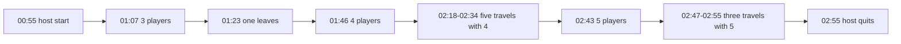

# Five-player session evidence

This file is the reference example of a working MorePlayers session with five
players. Use its log excerpts as the expected output when you test a later
build. The host ran one session from 2026-10-05 00:55 UTC to 02:55 UTC.

Player names and online IDs in the excerpts are replaced with labels. The
complete logs are kept locally in `lode/tmp/five-player-session-20261005/`.
That folder is not in git.

## Build and configuration

| Item | Value |
|---|---|
| Source commit | `d4223f9` (Allow more than three players in MorePlayers sessions) |
| `dlls/main.dll` SHA-256 | `5193CA086579B04806E011002090A8EB1BEFA548B69489082352FF3D792F6C02` |
| `Scripts/main.lua` SHA-256 prefix | `F4C4DFD2C067426F` |
| `config.ini` | `MaxPlayers=25`, `PartyUiDiagnostics=0` |
| Wayfinder build | `CHANGELISTNUMBER_SEARCH=211130` |

## Timeline



| Time (UTC) | Event | Players |
|---|---|---|
| 01:07:00, 01:07:30 | Player A and Player B join | 3 |
| 01:23:18 | One connection closes | 2 |
| 01:26:49 | Player C joins | 3 |
| 01:46:44 | Player D joins | 4 |
| 01:57:56 | One connection closes | 3 |
| 02:16:36 | Player E joins | 4 |
| 02:18 to 02:34 | Five map travels | 4 |
| 02:43:12 | Player F joins | 5 |
| 02:47:01, 02:48:58, 02:55:30 | Three map travels, five `client-loading-complete` each | 5 |
| 02:55:54 | Host quits, four connections close with `ClosedLocally` | 1 |

## Counts

| Check | Result |
|---|---|
| `UpdateHostSessionEmptyParty` publications | 556 |
| `UpdateHostSessionFullParty` publications | 0 |
| EOS `UpdateSessionModification` calls | 564, no failure |
| Failed `SetLobbyMemberLimit` | 0 |
| Full-party suppressions | 0 |
| Kick, network error, or travel error events | 0 |
| Party controls shown | 26 at 3, 21 at 4, 5 at 5, 1 at 6 players |
| Party controls errors | 0 |

## Startup excerpts

`MorePlayersSteamLimit.log`:

```text
[MorePlayersSteamLimit] Session capacity patch applied at 4 sites
[MorePlayersSteamLimit] Full-party threshold patch applied at 2 sites
[MorePlayersSteamLimit] Full-party hook not installed: the full-party threshold is the configured limit
[MorePlayersSteamLimit] EOS Sessions_CreateSessionModification api=4 session=GameSession bucket=Atlas_1.0.0 max_players=25 -> 25
[MorePlayersSteamLimit] SetLobbyMemberLimit 25 -> 25 lobby=<lobby id>
[MorePlayersSteamLimit] SetLobbyMemberLimit result=1
```

`UE4SS.log`:

```text
[MorePlayers] Party invite controls hook ready
[MorePlayers] Party invite controls first call players=1 (number) host=true (boolean) probe=shown
```

## Join excerpt

The fifth player joins (`Atlas.log`):

```text
[2026.10.05-02.43.12:032] LogNet: Login request: ?Name=<Player F> userId: EOSPlus:<id> platform: EOSPlus
[2026.10.05-02.43.12:718] LogGameState: AWFGameState::AddPlayerState: PlayerArray.Num() = 5
[2026.10.05-02.43.12:765] LogNet: Join succeeded: <Player F>
```

## Map travel excerpt

A travel with five players rebuilds the player array on the new map. Each
client then swaps its player state. The count is 6 for about 2 ms per swap.

```text
[02.47.01:590] AddPlayerState: PlayerArray.Num() = 1
...
[02.47.01:614] AddPlayerState: PlayerArray.Num() = 5
[02.47.01:681] AddPlayerState: PlayerArray.Num() = 6
[02.47.01:681] RemovePlayerState: PlayerArray.Num() = 5
[02.47.03:047] AddPlayerState: PlayerArray.Num() = 6
[02.47.03:051] RemovePlayerState: PlayerArray.Num() = 5
```

The party controls hook can see the transient count:

```text
[MorePlayers] Party invite controls players=6 limit=25 result=shown
[MorePlayers] Party invite controls players=5 limit=25 result=shown
```

## Host exit excerpt

```text
[02.55.54:649] LogNet: UNetConnection::Close: ... IsServer: YES ...
LogEOSP2P: Connection closed. ... Reason=[ClosedLocally]
```

`ClosedLocally` on every connection at the same moment means that the host
closed the session. It is not a network failure.

## Verification commands

Run these commands in the saved log folder:

```bash
grep -a -c 'setting session settings full' Atlas.log
grep -a 'Join succeeded' Atlas.log
grep -a 'PlayerArray.Num() = 5' Atlas.log
grep -a -o 'Party invite controls players=[0-9]* limit=25 result=[a-z-]*' UE4SS.log | sort | uniq -c
grep -a 'UpdateSessionModification result=' MorePlayersSteamLimit-this-run.log | grep -v -c 'result=0'
```

## Lessons learned

- A short `PlayerArray.Num()` value of `players + 1` during map travel is
  normal. Do not count it as a join.
- Count joins from `Join succeeded` and leaves from `UNetConnection::Close`.
- `UE4SS.log` is overwritten at each game start. Copy it before the next start.
- EOS P2P can log `State=[ConnectionLost]` followed by `successfully
  reconnected`. That is a recovered connection, not a leave.

Related: [Session capacity](session-capacity.md), [Party UI](party-ui.md),
[Runtime diagnostics](diagnostics.md), and
[Capacity checks in Wayfinder.exe](capacity-binary-map.md).
