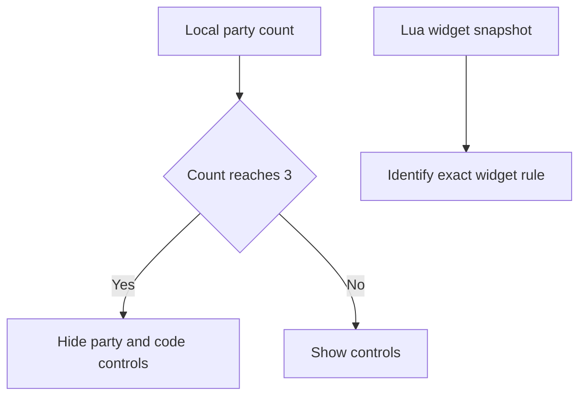

# Party UI

Wayfinder hides the `+Party Member` and `Code` controls when its local party UI
reaches the original three-player limit. Reflection shows dynamic party storage
and separate party-size settings, so the behavior is not a fixed member array.



## Current diagnostics

- Lua records party-related widgets after `PartyComponent:CLIENT_RefreshParty`.
- F9 records a manual widget snapshot.
- `PartyUiDiagnostics=0` disables these snapshots.
- The diagnostic records widget names, visibility, and enabled state.

## Example log

```text
[MorePlayers] Party UI snapshot begin reason=AddPlayerState
[MorePlayers] Party UI widget name=... visibility=... enabled=...
```

## Current limit behavior

Lua sets `AGameSession.MaxPartySize` and
`USocialSettings.DefaultMaxPartySize`. Test these settings before forcing
widget visibility. A host-only UI fix changes only the host display. Client
displays require a client-side UI mod.

Related: [Runtime summary](summary.md), [Session capacity](session-capacity.md),
[Runtime reflection](reflection.md), and [Roadmap](../plans/roadmap.md).
