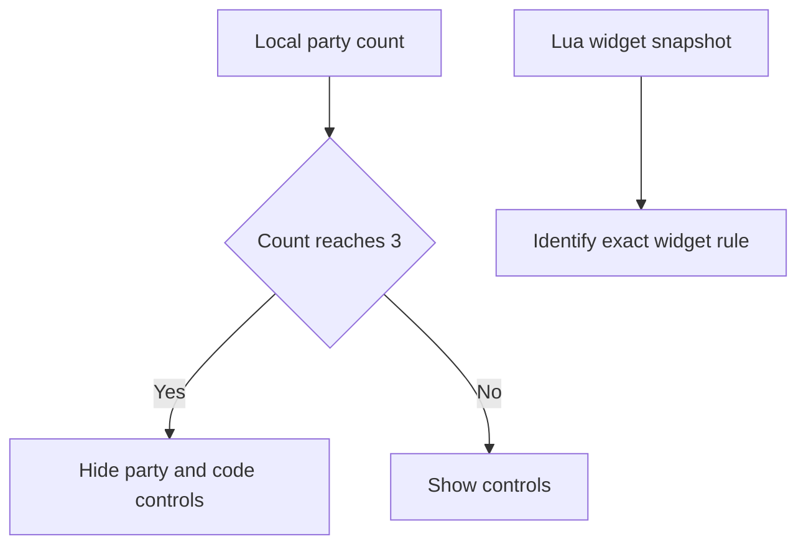

# Party UI

Wayfinder hides the `+Party Member` and `Code` controls when its local party UI
reaches the original three-player limit. The online session code remains
available, so this behavior is a local widget rule.



## Current diagnostics

- Lua records party-related widgets after `GameStateBase:AddPlayerState`.
- F9 records a manual widget snapshot.
- `PartyUiDiagnostics=0` disables these snapshots.
- The diagnostic records widget names, visibility, and enabled state.

## Example log

```text
[MorePlayers] Party UI snapshot begin reason=AddPlayerState
[MorePlayers] Party UI widget name=... visibility=... enabled=...
```

## Pending decision

Identify the exact cooked widget before changing visibility. A host-only UI fix
changes only the host display. Client displays require a client-side UI mod.

Related: [Runtime summary](summary.md), [Session capacity](session-capacity.md), and [Roadmap](../plans/roadmap.md).
