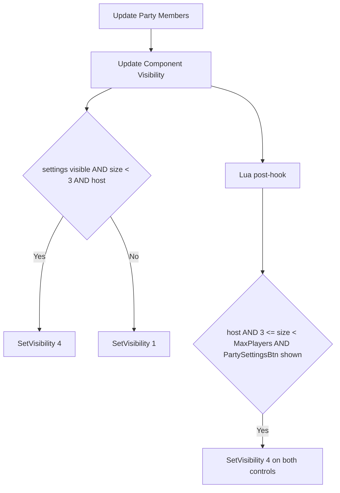

# Party UI

The pause menu party page hides the `+Party Member` and `Code` controls at 3
players. A constant in the Blueprint causes this, not a fixed member array.
The MorePlayersPlus Lua script shows both controls again for the host while the
party has fewer than `MaxPlayers` players.



## Controls and their actions

`PauseMenuPartyWidget_C` owns the party controls. Its class path is
`/Game/UI/UI_WF_Blueprints/UI_WF_UIPages/Coop/PauseMenuPartyWidget.PauseMenuPartyWidget_C`.
The patch pak (`Atlas-WindowsNoEditor_0_P.pak`) contains the current copy.

- `UI_AddPlayerWidget` (`+Party Member`, `UI_AddPlayerWidget_C` derived from
  `UWFAddPlayerWidget`)
- `Button_InviteCodePopup` (`Code`, opens `UI_InviteCodePopup`)
- `PartySettingsBtn`, `Button_FindParty`, and `SessionBrowserBtn`

`UI_AddPlayerWidget_C` calls `OpenPlatformUI()` from its ubergraph.
`UWFAddPlayerWidget::OpenPlatformUI` (`0x141A03930`) calls the EOSPlus
`GetExternalUIInterface` (`+0x78`), then `ShowInviteUI(0, GameSession)`
(`+0x20`). EOSPlus forwards the call to Steam, because the EOS overlay is
disabled. Thus `+Party Member` opens the Steam overlay invite.

The social-list Invite (`UPlayerListUI::InviteSelectedPlayer`, `0x14187F340`)
and the chat Invite (`UWFChatWidget::SendPartyInvite`, `0x141648980`) are
different. They send only a Digital Extremes party invite through
`UDEClientConnection::SendPartyInvite` (`0x14184F220`). The DE client is not
logged in, so these invites fail locally and send no request.

## Blueprint visibility rule

`Update Party Members` calls `Update Component Visibility(int32 Player Array
Size, bool Is Player Host)` with the player array length and `GetIsHost`. The
Kismet bytecode sets these values. Value 4 is
`ESlateVisibility::SelfHitTestInvisible`, and value 1 is `Collapsed`.

| Control | Value 4 when |
|---|---|
| `PartySettingsBtn` | party settings visible AND host |
| `Button_InviteCodePopup` | party settings visible AND size < 3 AND host |
| `UI_AddPlayerWidget` | party settings visible AND size < 3 AND host |
| `Button_FindParty` | party settings visible AND size < 2 AND host |

No other function or ubergraph event in either Blueprint changes the
visibility of `+Party Member` or `Code`.

## Lua fix

UE4SS 3.0.1 runs a Blueprint hook after the function body, as a
`ProcessLocalScriptFunction` post-callback. A hook therefore cannot change the
size parameter before the Blueprint reads it. The Lua post-hook sets the
visibility itself:

```lua
if host == true and size >= 3 and size < MAX_PLAYERS
    and widget.PartySettingsBtn.Visibility == 4 then
    widget.UI_AddPlayerWidget:SetVisibility(4)
    widget.Button_InviteCodePopup:SetVisibility(4)
end
```

`PartySettingsBtn` has value 4 exactly when the other Blueprint conditions are
true. Thus the hook reproduces the Blueprint rule with `MaxPlayers` in place of
3. At `MaxPlayers`, the Blueprint result stays: both controls are hidden.

The script loads the widget class with `LoadAsset` inside
`ExecuteInGameThread`, then registers the hook. SkipStartupWarnings uses the
same pattern.

The startup action has two known residual risks:

- It can run on the game thread while UE4SS-UpdateThread still starts later
  mods, for example SkipStartupWarnings. Its `make_hook_state` emplace into
  `lua_instances` can then race their `new_thread` and `register_function`
  calls. SkipStartupWarnings has the same exposure. The `LoadAsset` load takes
  tens of milliseconds, so the window is small.
- It has no thread-id check. The `LoadAsset` guard checks only the
  `IsInGameThread` registry flag, which `process_event_hook` sets on any thread
  that calls ProcessEvent.

UE4SS reads an `EnumProperty` as an integer. Each read also writes a global
`Enum_Visibility` table.

## Diagnostics

- `Party invite controls hook ready` confirms the registration.
- The first call writes one line with the parameter values and Lua types.
  Below 3 players it also runs the restore code once (`probe=shown`). The
  Blueprint already shows both controls there, so the probe changes nothing on
  screen. A solo run thus proves the enum read and the `SetVisibility` calls.
- Each restore writes `Party invite controls players=N limit=M result=shown`.
- `PartyUiDiagnostics=1` records party widget snapshots after
  `PartyComponent:CLIENT_RefreshParty` and on F9.

```text
[MorePlayersPlus] Party invite controls first call players=1 (number) host=true (boolean) probe=shown
[MorePlayersPlus] Party invite controls players=3 limit=25 result=shown
```

## Limits

The controls are host-only in the Blueprint, so the host-side fix covers them.
A solo run confirms the registration, the parameter types, and the restore code
(`probe=shown`). A 3-player host run confirms the restore branch: `UE4SS.log`
shows `Party invite controls players=3 limit=25 result=shown` each time the
party page updates. A 4-player host run shows the same result with
`players=4`, and the fourth player joined through these controls. During map
travel the hook can see a transient count of players + 1. See
[Five-player session evidence](five-player-session.md).

An offline Lua test loads `main.lua` with stub UE4SS globals, captures the
registered callback, and calls it with fake widgets. The test script is not
kept in the repository.

Players can also join without these controls:

- the Steam overlay invite (Shift+Tab, then invite a friend)
- Steam friends list `Join Game`
- the session browser

Related: [Runtime summary](summary.md), [Session capacity](session-capacity.md),
[Capacity checks in Wayfinder.exe](capacity-binary-map.md),
[Runtime reflection](reflection.md), and [Roadmap](../plans/roadmap.md).
