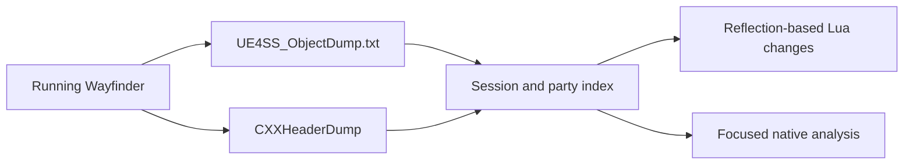

# Runtime reflection

UE4SS object and C++ header dumps expose Wayfinder's reflected classes,
properties, and function signatures. The dumps do not contain native function
bodies or complete Blueprint graph logic.



## Confirmed party model

- `AGameSession` contains `MaxPlayers` at `0x22C` and `MaxPartySize` at
  `0x230`.
- `USocialSettings` contains `DefaultMaxPartySize` at `0x38`.
- `UPartyComponent` stores members in `TArray<FWFPartyMemberInfo> m_Players`.
- `USocialParty` stores members in `PartyMembersById`, which is a map.
- `UUI_PartyWidget_C:UpdatePlayers` uses the party member array and creates
  entries in `PartyMemberBox`.
- `UUI_Page_Social_C` has fourteen reflected party-entry widget references.
- `UWFGameInstance` provides session-code read, reset, remove, and search
  functions.

These findings show dynamic party storage. They do not prove that every
gameplay system supports fourteen or more players.

## Applied limits

The Lua mod sets `MaxPlayers`, `MaxPartySize`, and `DefaultMaxPartySize` from
the shared `MaxPlayers` configuration value.

```lua
context.MaxPlayers = MAX_PLAYERS
context.MaxPartySize = MAX_PLAYERS
```

`DefaultMaxPartySize` belongs to `USocialSettings`, not `AGameSession`. The Lua
mod updates its default object and newly created settings objects.

## Generated artifacts

```text
Atlas/Binaries/Win64/UE4SS_ObjectDump.txt
Atlas/Binaries/Win64/CXXHeaderDump/
```

The repository tool at `tools/recon/WayfinderDump` generates the object dump.
Generated dumps remain outside Git because they are large game-derived files.

Related: [Session capacity](session-capacity.md),
[Party UI](party-ui.md), and [Runtime stability](stability.md).
