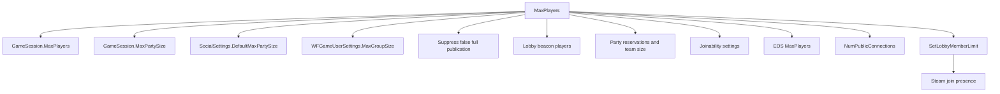

# Session capacity

The configured player limit must reach Unreal, EOS, and Steam. A change in only
one layer can leave the session hidden, full, or unable to accept invitations.



## Contracts

- Lua sets four known `GameSession` classes to `MaxPlayers` and
  `MaxPartySize`.
- Lua sets the social system's `DefaultMaxPartySize`.
- Lua sets the local `WFGameUserSettings.MaxGroupSize` value.
- Lua reapplies `MaxGroupSize` before `UpdateSessionSettingsHelper`,
  `OnPartyCreatedOrJoined`, and `OnPartyUpdated` publish session or party data.
- Lua sets `LobbyBeaconState.MaxPlayers` on each created lobby beacon.
- Lua sets `PartyBeaconState.MaxReservations` on each created party beacon.
- Lua raises a positive `PartyBeaconState.NumPlayersPerTeam` below the
  configured limit.
- Lua checks each beacon again after one second because beacon initialization
  can replace constructor values.
- Lua changes `FJoinabilitySettings.MaxPlayers` and `MaxPartySize` in the
  reflected `ClientSetInviteFlags` parameter buffer.
- Lua enables `bAllowInvites` and `bJoinViaPresence` in the same buffer.
- Lua preserves public-search and friends-only settings.
- C++ replaces EOS capacity values lower than the configured limit.
- C++ replaces Steam lobby limit requests lower than the configured limit.
- C++ suppresses `UWFGameInstance::UpdateHostSessionFullParty` so Wayfinder
  does not publish the host as full after the third player joins.
- The supported function starts at `Wayfinder.exe + 0x164D770`.
- Its validator matches the complete 24-byte prologue, beginning with
  `48 89 5C 24 10 48 89 74 24 18`.
- The full-party hook validates the Wayfinder function prologue before it is
  enabled. A game update with different code leaves the hook disabled.
- The original API receives the modified value and must return success.
- Repeated `3 -> configured limit` messages are expected session refreshes.

## Native hook maintenance

Find `UWFGameInstance::UpdateHostSessionFullParty` through the UTF-16 log string
that contains its full function name. Follow the string's code reference to the
native function.

Confirm the function boundary and Windows x64 arguments before changing the
hook. `RCX` must contain the `this` pointer, and `DL` must contain the Boolean
argument for the current function type.

```text
RVA = function VA - image base
0x164D770 = 0x14164D770 - 0x140000000
```

Capture complete entry instructions for `expected_prologue`. Avoid relocation
bytes and offsets inside the function. Keep the validator enabled after every
game update.

The complete maintenance procedure is in
[`src/mods/MorePlayers/native/README.md`](../../src/mods/MorePlayers/native/README.md#updating-the-full-party-hook).

## Example log

```text
[MorePlayersSteamLimit] SetLobbyMemberLimit 3 -> 25 lobby=...
[MorePlayersSteamLimit] SetLobbyMemberLimit result=1
[MorePlayersSteamLimit] Hooked UWFGameInstance::UpdateHostSessionFullParty[Wayfinder+0x164D770]
[MorePlayers] Online party maximum phase=session-publication group_size=3.0->25.0
[MorePlayers] Party beacon limits phase=recheck reservations=3->25 team_size=3->25 consumed=3
```

## Known limit

`UDEClientConnection::SetPresence` publishes `map`, `platform`, and
`samePlatformOnly`; it does not publish party capacity. Runtime logs show that
`UWFGameInstance::UpdateHostSessionFullParty` separately publishes the full
state after three players are connected.
The joinability override remains an experimental secondary path because Steam
invitation joins observed during testing did not call the reflected beacon
function.

Related: [Runtime summary](summary.md), [Party UI](party-ui.md), and [Roadmap](../plans/roadmap.md).
