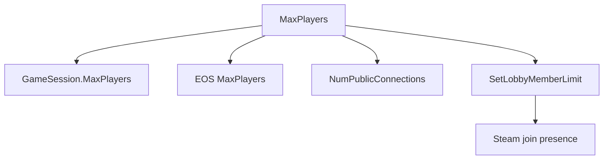

# Session capacity

The configured player limit must reach Unreal, EOS, and Steam. A change in only
one layer can leave the session hidden, full, or unable to accept invitations.



## Contracts

- Lua sets four known `GameSession` classes to `MaxPlayers`.
- C++ replaces EOS capacity values lower than the configured limit.
- C++ replaces Steam lobby limit requests lower than the configured limit.
- The original API receives the modified value and must return success.
- Repeated `3 -> configured limit` messages are expected session refreshes.

## Example log

```text
[MorePlayersSteamLimit] SetLobbyMemberLimit 3 -> 25 lobby=...
[MorePlayersSteamLimit] SetLobbyMemberLimit result=1
```

## Known limit

Current logs prove configured capacity, not the current connected-player count.

Related: [Runtime summary](summary.md), [Party UI](party-ui.md), and [Roadmap](../plans/roadmap.md).
