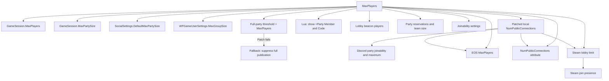

# Session capacity

The configured player limit must reach Unreal, EOS, and Steam. A change in only
one layer can leave the session hidden, full, or unable to accept invitations.



## Contracts

- Lua sets four known `GameSession` classes to `MaxPlayers` and
  `MaxPartySize`.
- Lua sets the social system's `DefaultMaxPartySize`.
- Lua sets the local `WFGameUserSettings.MaxGroupSize` value. Only a
  settings-menu getter (`0x1418BB590`) reads this value. It does not set the
  session capacity.
- Lua reapplies `MaxGroupSize` before `UpdateSessionSettingsHelper`,
  `OnPartyCreatedOrJoined`, and `OnPartyUpdated` publish session or party data.
- Lua sets `LobbyBeaconState.MaxPlayers` on each created lobby beacon.
- Lua sets `PartyBeaconState.MaxReservations` on each created party beacon.
- Lua raises a positive `PartyBeaconState.NumPlayersPerTeam` below the
  configured limit.
- Lua checks each beacon again after one second because beacon initialization
  can replace constructor values.
- Lua changes `FJoinabilitySettings.MaxPlayers` and `MaxPartySize` in the
  reflected `ClientSetInviteFlags` parameter buffer.
- Lua enables `bAllowInvites` and `bJoinViaPresence` in the same buffer.
- Lua preserves public-search and friends-only settings.
- C++ changes the four instructions that write 3 to the hosted session's
  `NumPublicConnections` to the configured limit. The host's named session
  then holds the configured limit.
- C++ changes the two full-party selectors (`cmp [reg+248h], 3`) to the
  configured limit. Wayfinder then publishes the open session with current
  attributes up to `MaxPlayers - 1` players and the full session at
  `MaxPlayers`.
- `patch_immediates` applies each instruction group. It compares all sites of
  the group, checks that each site is in the image, and makes each site
  writable before the first write. If one step fails, no site in that group
  changes.
- A patch site matches when its instruction prefix is correct and its
  immediate value is from 3 through 25.
- C++ replaces EOS capacity values lower than the configured limit.
- C++ replaces Steam lobby limit requests lower than the configured limit.
- C++ suppresses `UWFGameInstance::UpdateHostSessionFullParty` only when the
  full-party threshold patch does not apply. Only the two selectors lead to
  that function.
- Lua shows the pause menu `+Party Member` and `Code` controls for the host
  from 3 to `MaxPlayers - 1` players. See [Party UI](party-ui.md).
- C++ schedules native installation during `on_program_start` and runs it from
  the first `on_update` call after UE4SS starts its event loop.
- C++ applies both instruction groups before it creates hooks. It applies the
  threshold group only after the session capacity group applies. Otherwise it
  keeps the original threshold and installs the suppression hook.
- C++ creates the Steam hook, and the full-party fallback hook when necessary,
  while disabled. It queues them and activates them with one `MH_ApplyQueued`
  call.
- EOS hook installation waits five seconds after Unreal initialization. This
  avoids patching EOS during its initial startup calls.
- Native startup must return before UE4SS continues `enabled.txt` discovery.
- The supported function starts at `Wayfinder.exe + 0x164D770`.
- Its validator matches the complete 24-byte prologue, beginning with
  `48 89 5C 24 10 48 89 74 24 18`.
- The full-party fallback hook validates the Wayfinder function prologue before
  it is enabled. A game update with different code leaves the hook disabled.
- The original API receives the modified value and must return success.
- With the instruction patch active, hook messages show
  `configured limit -> configured limit`. A `3 -> configured limit` message
  shows that the instruction patch is not active.

## Native hook maintenance

The full-party hook is only a fallback for a build where the threshold patch
does not apply. Find `UWFGameInstance::UpdateHostSessionFullParty` through the UTF-16 log string
that contains its full function name. Follow the string's code reference to the
native function.

Confirm the function boundary and Windows x64 arguments before changing the
hook. `RCX` must contain the `this` pointer, and `DL` must contain the Boolean
argument for the current function type.

```text
RVA = function VA - image base
0x164D770 = 0x14164D770 - 0x140000000
```

Capture complete entry instructions for `expected_prologue`. Avoid relocation
bytes and offsets inside the function. Keep the validator enabled after every
game update.

The complete maintenance procedure is in
[`src/mods/MorePlayers/native/README.md`](../../src/mods/MorePlayers/native/README.md#updating-the-full-party-hook).

## Example log

```text
[MorePlayersSteamLimit] Session capacity patch applied at 4 sites
[MorePlayersSteamLimit] Full-party threshold patch applied at 2 sites
[MorePlayersSteamLimit] Full-party hook not installed: the full-party threshold is the configured limit
[MorePlayersSteamLimit] SetLobbyMemberLimit 25 -> 25 lobby=...
[MorePlayersSteamLimit] SetLobbyMemberLimit result=1
[MorePlayers] Party invite controls hook ready
[MorePlayers] Online party maximum phase=session-publication group_size=3.0->25.0
[MorePlayers] Party beacon limits phase=recheck reservations=3->25 team_size=3->25 consumed=3
```

```cpp
if (g_install_requested.exchange(false)) {
    install();
}
```

## Known limit

`UDEClientConnection::SetPresence` publishes `map`, `platform`, and
`samePlatformOnly`; it does not publish party capacity.
The joinability override remains an experimental secondary path because Steam
invitation joins observed during testing did not call the reflected beacon
function.

A solo host run confirms the instruction patch. The host session dump shows
`NumPublicConnections: 25` and `NumOpenPublicConnections: 24`. The EOS and
Steam hooks log `25 -> 25`.

```text
[MorePlayersSteamLimit] Session capacity patch applied at 4 sites
[MorePlayersSteamLimit] EOS Sessions_CreateSessionModification ... max_players=25 -> 25
LogOnlineSession: Verbose: OSS: 	NumPublicConnections: 25
```

A solo host run confirms that both instruction groups apply, that the
full-party hook is not installed, and that the party controls hook fires with a
numeric player count and a boolean host flag.

A 3-player host run confirms the behavior at 3 players. `Atlas.log` shows 91
`UpdateHostSessionEmptyParty` publications and no `UpdateHostSessionFullParty`
publication. The native log shows 95 EOS session updates with no failure and
no suppression. The power level and `PLAYERTWO` attributes change during play.
`PlayerArray.Num() = 4` appears only for a moment during map travel, when a new
player state is added before the old one is removed.

A 4-player host run confirms a fourth player join. The fourth player joined
and stayed for about 11 minutes. `Atlas.log` shows 118 open publications and no
full publication. The native log shows 123 EOS session updates with no failure
and no failed Steam lobby limit. `UE4SS.log` shows no kick, network error, or
travel error.

```text
[MorePlayersSteamLimit] Full-party threshold patch applied at 2 sites
[MorePlayersSteamLimit] Full-party hook not installed: the full-party threshold is the configured limit
[MorePlayers] Party invite controls first call players=1 (number) host=true (boolean)
```

A map travel with four players to Skylight succeeded. Each client swapped its
player state (`PlayerArray.Num()` 5, then 4 in the same 2 ms), and all four
players reported `client-loading-complete`. A fifth player joined the same
session (`PlayerArray.Num() = 5`, `Join succeeded`) with no full publication. The Digital Extremes backend is not connected, so it cannot enforce a
party limit.

Lesson learned: the original 3-player stop had several causes. The host hid
its invite controls at 3 players, published the session as full at 3 players,
and kept a local capacity of 3. A fix in one layer did not change the result.

[Capacity checks in Wayfinder.exe](capacity-binary-map.md) lists each
capacity check in the game binary.

Related: [Runtime summary](summary.md), [Party UI](party-ui.md), and [Roadmap](../plans/roadmap.md).
