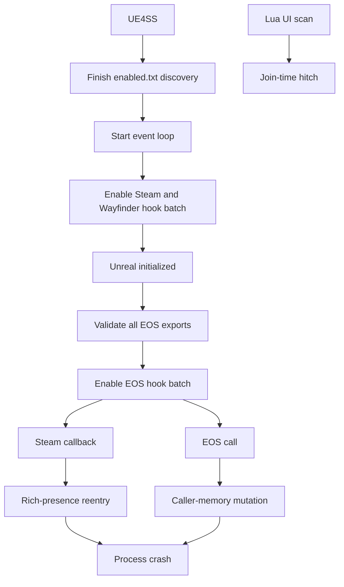

# Runtime stability

The native DLL changes calls at the Steam and EOS boundaries. These hooks can
crash the process when an ABI assumption, caller-owned value, or hook lifetime
is invalid. Lua diagnostics can also cause hitches during player joins.



## Confirmed evidence

- One captured crash stack contains `steamclient64`, two `main.dll` frames, and
  Wayfinder frames.
- The Steam crash occurred on a Steam call path through the native companion.
- Another captured null-read crash contains Wayfinder frames without
  `main.dll`. The native DLL does not explain every observed crash.
- Current logs show valid EOS API version fields and successful Steam limit
  results. This evidence supports the present layouts but cannot protect
  against a game or SDK update.
- EOS hook installation starts five seconds after UE4SS reports that Unreal
  initialization is complete.
- Steam and Wayfinder hook creation runs on the first UE4SS event-loop update.
- The installer creates the Steam and full-party hooks while disabled and
  enables both with one MinHook batch operation.
- Activating an individual native hook during `on_program_start` blocked later
  `enabled.txt` mods. Activating the hooks from a concurrent worker caused a
  null execute access violation during Wayfinder initialization.
- The installer resolves every required EOS export and verifies executable
  memory before it creates a hook.
- The installer creates all EOS hooks while disabled. It then enables the
  complete set with one MinHook batch operation.
- A failed operation removes every hook created by that attempt. The installer
  retries after two seconds and never records a partial set as installed.

## Risk order

1. `publish_invite_state` calls Steam rich-presence functions from inside the
   `SetLobbyMemberLimit` hook. This nested Steam call is the leading native
   crash suspect.
2. EOS hooks use `const_cast` to change caller-owned option structures. Shared
   or read-only storage makes these temporary writes unsafe.
3. The DLL defines partial EOS structures and a Steam vtable index without the
   vendor headers. An SDK update can change an assumed ABI.
4. The mod destructor disables all MinHook hooks. This can affect hooks owned
   by another mod and can race with active calls.
5. Each hook performs synchronous formatted logging and opens the log file.
   EOS attribute updates make this path frequent.
6. Party UI diagnostics scan every live widget after each player-state add.
   Delayed scans can overlap world changes and cause large frame hitches.
7. Wayfinder exposes fixed three-player behavior in its UI and session data.
   Raising transport limits does not prove that every gameplay system supports
   additional players.

## Unsafe pattern example

```cpp
mutable_options = const_cast<EosSessionSetMaxPlayersOptions*>(options);
mutable_options->MaxPlayers = effective;
```

Prefer a local structure copy. Pass the copy to EOS without changing the
caller's storage. Publish Steam invite state outside the matchmaking hook.

## Installation contract example

```cpp
if (g_unreal_ready && all_targets_executable()) {
    create_disabled_hooks();
    enable_hook_batch();
}
```

Related: [Runtime summary](summary.md),
[Session capacity](session-capacity.md), and
[Runtime diagnostics](diagnostics.md).
