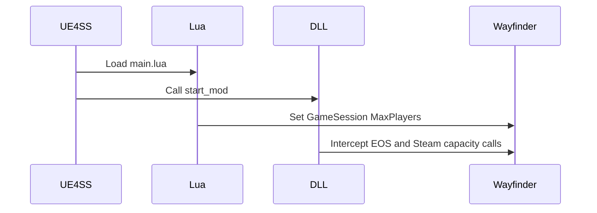

# Runtime summary

UE4SS loads the Lua script and native DLL from the same `MorePlayers` mod. Both
components read `Mods/MorePlayers/config.ini` at process startup.



## Runtime files

```text
Mods/MorePlayers/Scripts/main.lua
Mods/MorePlayers/dlls/main.dll
Mods/MorePlayers/config.ini
```

## Invariants

- Lua changes Unreal object properties.
- C++ changes external online-service calls.
- The native DLL keeps its separate diagnostic log.
- UE4SS records Lua output in `UE4SS.log`.

Related: [Session capacity](session-capacity.md), [Party UI](party-ui.md), [Runtime diagnostics](diagnostics.md), and [Project summary](../summary.md).
