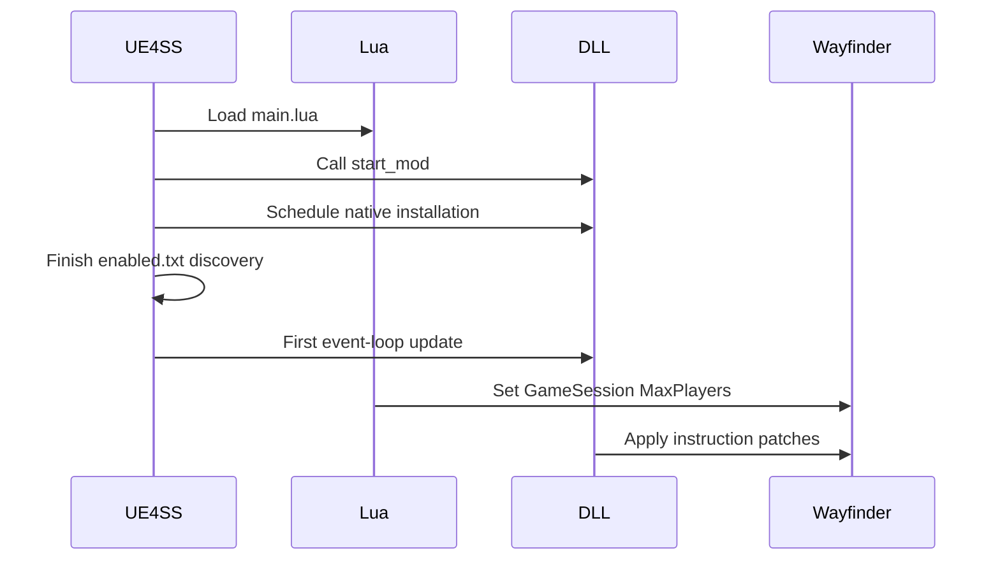

# Runtime summary

UE4SS loads the Lua script and native DLL from the same `MorePlayersPlus` mod. Both
components read `Mods/MorePlayersPlus/config.ini` at process startup.
Both accept the same `MaxPlayers` lines. See
[Configuration parsing](config-parsing.md).



## Runtime files

```text
Mods/MorePlayersPlus/Scripts/main.lua
Mods/MorePlayersPlus/dlls/main.dll
Mods/MorePlayersPlus/config.ini
```

## Invariants

- Lua changes Unreal object properties.
- C++ changes six Wayfinder instructions: four session-capacity sites and two
  full-party threshold sites. In the fallback, it also changes external
  online-service calls through MinHook.
- C++ does not activate MinHook from the UE4SS startup callback.
- The first event-loop update applies the instruction patches. When both groups
  apply, it activates no hook. In the fallback, it activates the Steam hook and
  the full-party hook as one batch.
- The native DLL keeps its separate diagnostic log.
- UE4SS records Lua output in `UE4SS.log`.

```cpp
virtual void on_program_start() { g_install_requested = true; }
```

Related: [Session capacity](session-capacity.md), [Party UI](party-ui.md), [Runtime diagnostics](diagnostics.md), and [Project summary](../summary.md).
