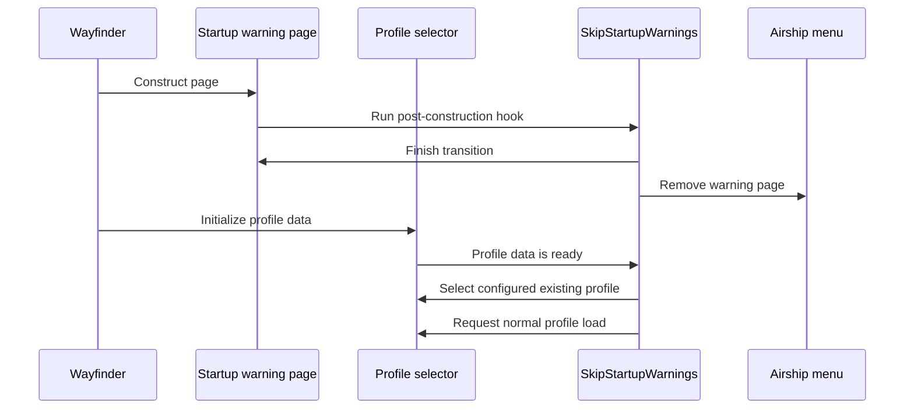

# Startup warning skip

SkipStartupWarnings is a standalone UE4SS Lua mod. It closes Wayfinder's
epilepsy and autosave warning pages during startup. It can select and load a
configured existing profile. The mod does not suppress the in-game autosave
indicator.



## Contract

- `SkipEpilepsyWarning=1` closes `UI_EpilepsyWarningPage_C`.
- `SkipAutoSaveWarning=1` closes `UI_AutoSaveWarningPage_C`.
- `AutoLoadProfile=1` selects and loads the first existing profile.
- `AutoLoadProfile=0` leaves the profile selector open.
- Profile numbers in the configuration are one-based.
- Each option defaults to enabled.
- The Lua hook runs after the Blueprint `Construct` function.
- The hook uses Wayfinder's normal Airship menu removal function.
- A failed skip leaves the warning page available.
- An empty, missing, unreadable, or unselectable profile leaves the selector open.
- The mod checks `bHasData` before it requests a profile load.
- The mod does not create, edit, or replace save files.
- The mod does not change startup logo video files.
- The mod does not change `WFAutoSaveOverlay`.
- A `SkipStartupWarnings : 1` entry can load the mod before blocked `enabled.txt` mods.

## Runtime source

```text
src/mods/SkipStartupWarnings/content/Scripts/main.lua
```

The script loads each warning asset before it registers the Blueprint hook.
`RegisterHook` runs the callback after each asset `Construct` function.

```lua
RegisterHook(function_path, function(context_parameter)
    skip_warning(context_parameter, label)
end)
```

The profile hook waits for `WFProfileSelectPage:InternalProfileInitialized`.
It activates the matching `WFSaveProfileWidget` and verifies Wayfinder's
selected-profile state before it calls `CreateOrLoadProfile`.

```lua
if selected_profile_matches(page, target_index) then
    request_profile_load(page, AUTO_LOAD_PROFILE)
end
```

## Runtime example

```text
[SkipStartupWarnings] Hook ready: epilepsy
[SkipStartupWarnings] Skipped: epilepsy
[SkipStartupWarnings] Profile auto-load ready: profile 1
[SkipStartupWarnings] Load requested: profile 1
```

Wayfinder's local deployment lists `SkipStartupWarnings : 1` near the top of
`Atlas/Binaries/Win64/Mods/mods.txt`. This explicit load order prevents a
blocking `enabled.txt` mod from delaying SkipStartupWarnings.

Related: [Project summary](../summary.md),
[Runtime reflection](../runtime/reflection.md), and
[Build system](../distribution/build-system.md).
