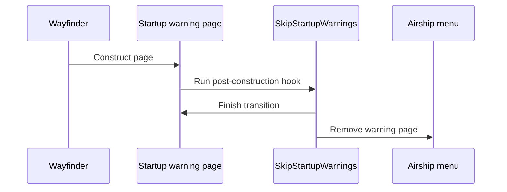

# Startup warning skip

SkipStartupWarnings is a standalone UE4SS Lua mod. It closes Wayfinder's
epilepsy and autosave warning pages during startup. It leaves the title prompt,
profile selector, main menu, and in-game autosave indicator unchanged.



## Contract

- `SkipEpilepsyWarning=1` closes `UI_EpilepsyWarningPage_C`.
- `SkipEpilepsyWarning=0` leaves the epilepsy warning open.
- `SkipAutoSaveWarning=1` closes `UI_AutoSaveWarningPage_C`.
- `SkipAutoSaveWarning=0` leaves the autosave warning open.
- Both options default to enabled.
- Each Lua hook runs after the Blueprint `Construct` function.
- The hook uses Wayfinder's normal Airship menu removal function.
- A failed skip leaves the warning page available.
- The mod does not act on the title prompt or later menus.
- The mod does not create, edit, or replace save files.
- The mod does not change startup logo video files.
- The mod does not change `WFAutoSaveOverlay`.
- The mod loads through `enabled.txt` after MorePlayersPlus completes mod discovery.
- The local deployment does not require a `mods.txt` load-order entry.

## Runtime source

```text
src/mods/SkipStartupWarnings/content/Scripts/main.lua
```

The script loads each warning asset before it registers the Blueprint hook.
`RegisterHook` runs the callback after each asset `Construct` function.

```lua
RegisterHook(function_path, function(context_parameter)
    skip_warning(context_parameter, label)
end)
```

## Runtime example

```text
[SkipStartupWarnings] Config epilepsy=enabled autosave=enabled
[SkipStartupWarnings] Hook ready: epilepsy
[SkipStartupWarnings] Hook ready: autosave
[SkipStartupWarnings] Skipped: epilepsy
[SkipStartupWarnings] Skipped: autosave
```

The current MorePlayersPlus native companion defers hook activation until the UE4SS
event loop starts. This keeps `enabled.txt` discovery unblocked and lets
SkipStartupWarnings register its two warning hooks normally.

Related: [Project summary](../summary.md),
[Runtime reflection](../runtime/reflection.md), and
[Build system](../distribution/build-system.md).
