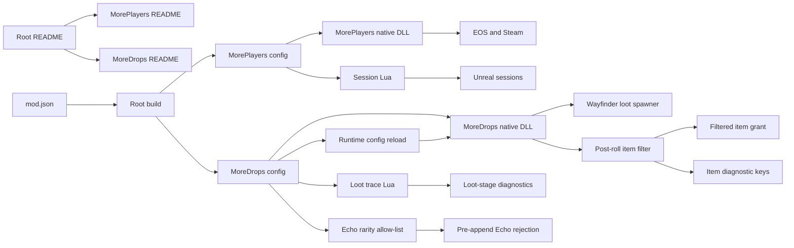

# Project summary

This repository is a manifest-based collection of Wayfinder mods. MorePlayers
raises the configured player limit across Unreal, EOS, and Steam. MoreDrops
scales loot probability and amount ranges through Wayfinder's central loot
spawner. MoreDrops also filters configured selected items and disallowed Echo
rarities. Echo rejection uses Wayfinder's normal temporary-item exit before an
inventory entry is appended. The root README lists available mods and shared
contributor instructions. Each mod owns its detailed guide.



## Current contract

- `MaxPlayers` supports values from 3 through 25.
- The host installs the mod. Joining clients do not need it for capacity.
- Wayfinder scales the game for the number of connected players.
- UE4SS 3.0.1 loads the Lua script and native DLL.
- The custom `GUObjectArray.lua` signature is required for Wayfinder.
- `src/mods/MorePlayers/mod.json` defines the MorePlayers package.
- `src/mods/MoreDrops/mod.json` defines the MoreDrops package.
- MoreDrops defaults to `2.0` core probability and `1.0` final probability multipliers.
- MoreDrops defaults to `1.0` minimum and maximum amount multipliers.
- MoreDrops supports multiplier values from `1.0` through `100.0`.
- MoreDrops item probabilities support percentages from `0` through `100`.
- MoreDrops applies the Echo rarity allow-list during synchronous central loot spawning.
- A disallowed Echo uses Wayfinder's normal temporary-item cleanup before append.
- Echo filtering fails open when the runtime path cannot be verified.
- MoreDrops does not move or destroy generated inventory entries.
- MoreDrops does not run the unsafe Lua item-catalog scan.
- Item diagnostics provide keys for observed loot items.
- MoreDrops reloads a changed `config.ini` during runtime before a valid loot call.
- MoreDrops hooks the native loot generator and keeps Lua hooks for bounded stage tracing.
- `README.md` contains the mod catalog and shared contributor instructions.
- `src/mods/MorePlayers/README.md` contains the complete MorePlayers guide.
- `build.ps1` discovers all manifests or selects one with `-Mod`.
- Each mod receives a separate Nexus Mods directory and ZIP file.

## Example

MorePlayers configuration:

```ini
MaxPlayers=25
PartyUiDiagnostics=0
```

MoreDrops configuration:

```ini
[General]
CoreProbabilityMultiplier=2.0
FinalProbabilityMultiplier=1.0
MinAmountMultiplier=1.0
MaxAmountMultiplier=1.0

[ItemProbability]
DataTableName:ItemRowName=0

[EchoFilter]
AllowedRarities=All
```

MoreDrops confirms an accepted runtime configuration with this log prefix:

```text
[MoreDropsNative] Config reloaded
```

Related: [Session capacity](runtime/session-capacity.md), [Drop scaling](loot/drop-scaling.md),
[Item filtering](loot/item-filtering.md), [Item catalog](loot/item-catalog.md),
and [Distribution](distribution/summary.md).
