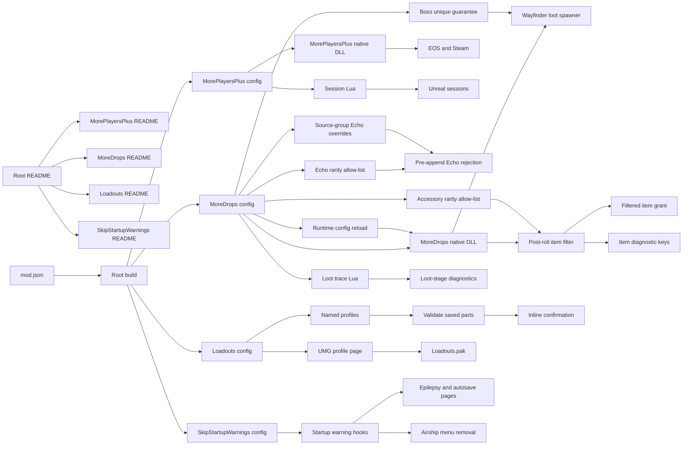

# Project summary

This repository is a manifest-based collection of Wayfinder mods. MorePlayersPlus
raises the configured player limit across Unreal, EOS, and Steam. MoreDrops
scales loot probability and amount ranges through Wayfinder's central loot
spawner. MoreDrops also filters configured selected items, disallowed Echo
rarities, and disallowed accessory or relic rarities. Echo rejection uses
Wayfinder's normal temporary-item exit before an inventory entry is appended.
Accessory and relic filtering uses the selected-item manifest. An optional
boss rule expands eligible boss-specific unique pools through Wayfinder's
normal distribution helpers. Three resource-backed options can change boss,
world-boss, elite, and miniboss Echoes to Epic before the Echo rarity filter.
Loadouts is a nonfunctional work in progress. Users must not install or use it.
Saving a loadout can crash Wayfinder. The root README lists available
mods and shared contributor instructions. SkipStartupWarnings closes the
epilepsy and autosave warning pages. It leaves later menus unchanged. Each mod
owns its detailed guide.



## Current contract

- `MaxPlayers` supports values from 3 through 25.
- The host installs the mod. Joining clients do not need it for capacity.
- Wayfinder writes a hosted session capacity of 3 at four instructions.
  MorePlayersPlus changes these instructions to write the configured limit.
- Wayfinder publishes the session as full at 3 players. MorePlayersPlus changes
  this threshold to the configured limit.
- The host pause menu shows `+Party Member` and `Code` below the configured
  limit.
- When both patch groups apply, MorePlayersPlus activates no MinHook hook.
  Its Steam, EOS, and full-party hooks are only a fallback.
- MorePlayersPlus and SkipStartupWarnings are prepared for a Nexus Mods
  release at version 1.0.0. See [Nexus Mods release plan](plans/nexus-release.md).
- Wayfinder scales the game for the number of connected players.
- UE4SS 3.0.1 loads the Lua script and native DLL.
- The custom `GUObjectArray.lua` signature is required for Wayfinder.
- `src/mods/MorePlayersPlus/mod.json` defines the MorePlayersPlus package.
- `src/mods/MoreDrops/mod.json` defines the MoreDrops package.
- `src/mods/Loadouts/mod.json` defines the Loadouts package.
- `src/mods/SkipStartupWarnings/mod.json` defines the SkipStartupWarnings package.
- MoreDrops defaults to `2.0` core probability and `1.0` final probability multipliers.
- MoreDrops defaults to `1.0` minimum and maximum amount multipliers.
- MoreDrops supports multiplier values from `1.0` through `100.0`.
- MoreDrops item probabilities support percentages from `0` through `100`.
- MoreDrops applies the Echo rarity allow-list during synchronous central loot spawning.
- A disallowed Echo uses Wayfinder's normal temporary-item cleanup before append.
- Echo filtering fails open when the runtime path cannot be verified.
- MoreDrops applies the accessory rarity allow-list to accessory and relic loot.
- Accessory recipe rows bypass the rarity filter.
- An unknown accessory or relic row fails open and stays in the loot result.
- MoreDrops can guarantee eligible items from each boss-specific unique pool.
- MoreDrops can change exact boss, world-boss, elite, and miniboss Echo rows
  to Epic.
- The Echo rarity filter remains authoritative after an Echo rarity override.
- Shared generic loot keeps its normal distribution behavior.
- Existing item and rarity filters remain authoritative after boss expansion.
- MoreDrops does not move or destroy generated inventory entries.
- MoreDrops does not run the unsafe Lua item-catalog scan.
- Item diagnostics provide keys for observed loot items.
- MoreDrops reloads a changed `config.ini` during runtime before a valid loot call.
- MoreDrops hooks the native loot generator and keeps Lua hooks for bounded stage tracing.
- Loadouts stores style, armor, weapons, Echoes, talents, and abilities.
- Loadouts is a nonfunctional work in progress and must not be distributed for use.
- Saving a loadout can crash Wayfinder.
- Loadouts stores schema version 3 profiles with trust flags for reset-sensitive sections.
- Loadouts migrates version 1 and version 2 profiles without trusting legacy empty sections.
- Loadouts captures current-loadout items with verified equipment-slot names and derives the hero group from the equipped Character item.
- Loadouts captures complex inventory-item state through its native scalar snapshot bridge; Lua does not convert `InventoryItemEntry` arrays.
- Loadouts preserves but refuses legacy profiles that have no verified equipment-slot names.
- Loadouts shows category counts instead of one aggregate item count.
- Loadouts uses one inline or console confirmation before it applies a profile with unavailable parts.
- A canceled Loadouts confirmation keeps the current configuration unchanged.
- Loadouts blocks destructive resets for incomplete holders, talent pools, style sets, and archetype trees.
- Loadouts never grants an item or changes inventory ownership.
- Loadouts adds one profile access button to the Character Loadout screen.
- The Loadouts UMG page uses the same validation and apply service as the console.
- A native Loadouts upgrade requires a complete Wayfinder restart.
- The Loadouts manifest builds `Loadouts.pak` with Unreal Engine 4.27.
- SkipStartupWarnings closes the epilepsy and autosave warning pages after construction.
- SkipStartupWarnings uses Wayfinder's Airship menu removal path.
- SkipStartupWarnings leaves the in-game autosave indicator active.
- SkipStartupWarnings leaves a warning visible when its normal removal path fails.
- SkipStartupWarnings loads only a configured profile that contains save data.
- An unavailable profile leaves the profile selector open.
- `README.md` contains the mod catalog and shared contributor instructions.
- `src/mods/MorePlayersPlus/README.md` contains the complete MorePlayersPlus guide.
- `build.ps1` discovers all manifests or selects one with `-Mod`.
- Each mod receives a separate Nexus Mods directory and ZIP file.

## Example

MorePlayersPlus configuration:

```ini
MaxPlayers=25
PartyUiDiagnostics=0
```

MoreDrops configuration:

```ini
[General]
CoreProbabilityMultiplier=2.0
FinalProbabilityMultiplier=1.0
MinAmountMultiplier=1.0
MaxAmountMultiplier=1.0

[ItemProbability]
DataTableName:ItemRowName=0

[EchoFilter]
AllowedRarities=All

[AccessoryFilter]
AllowedRarities=Epic

[BossDrops]
DropAllUniques=false

[EchoRarityOverride]
Bosses=Original
WorldBosses=Original
RareEnemies=Original
```

MoreDrops confirms an accepted runtime configuration with this log prefix:

```text
[MoreDropsNative] Config reloaded
```

Loadouts quick-profile configuration:

```ini
QuickProfileName=Quick
EnableQuickKeys=1
EnableLoadoutUi=1
```

SkipStartupWarnings configuration:

```ini
SkipEpilepsyWarning=1
SkipAutoSaveWarning=1
```

Related: [Session capacity](runtime/session-capacity.md), [Drop scaling](loot/drop-scaling.md),
[Item filtering](loot/item-filtering.md), [Item catalog](loot/item-catalog.md),
[Echo rarity overrides](loot/echo-rarity-overrides.md),
[Loadouts](loadouts/summary.md), [Loadouts service](loadouts/service.md),
[Loadouts interface](loadouts/ui.md),
[Startup warning skip](startup/summary.md), and [Distribution](distribution/summary.md).
