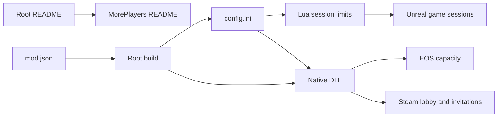

# Project summary

This repository is a manifest-based collection of Wayfinder mods. MorePlayers
is the current mod. It raises the configured player limit across Unreal, EOS,
and Steam while clients remain unmodified. The root README lists available
mods and shared contributor instructions. Each mod owns its detailed guide.



## Current contract

- `MaxPlayers` supports values from 3 through 25.
- The host installs the mod. Joining clients do not need it for capacity.
- Wayfinder scales the game for the number of connected players.
- UE4SS 3.0.1 loads the Lua script and native DLL.
- The custom `GUObjectArray.lua` signature is required for Wayfinder.
- `src/mods/MorePlayers/mod.json` defines the MorePlayers package.
- `README.md` contains the mod catalog and shared contributor instructions.
- `src/mods/MorePlayers/README.md` contains the complete MorePlayers guide.
- `build.ps1` discovers all manifests or selects one with `-Mod`.
- Each mod receives a separate Nexus Mods directory and ZIP file.

## Example

```ini
MaxPlayers=25
PartyUiDiagnostics=0
```

Related: [Session capacity](runtime/session-capacity.md), [Party UI](runtime/party-ui.md), and [Distribution](distribution/summary.md).
