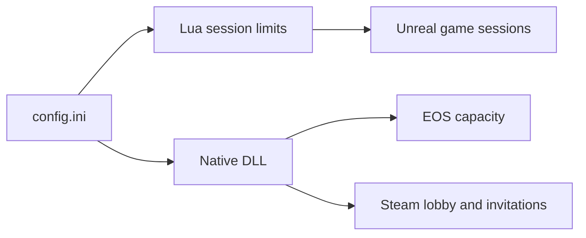

# Project summary

Wayfinder MorePlayers is a host-side UE4SS mod for Wayfinder. It raises the
configured player limit across Unreal, EOS, and Steam while clients remain
unmodified. The project combines a Lua mod, a native C++ companion, a custom
Wayfinder UE4SS signature, and generated hosting-site distributions.



## Current contract

- `MaxPlayers` supports values from 3 through 25.
- The host installs the mod. Joining clients do not need it for capacity.
- Wayfinder scales the game for the number of connected players.
- UE4SS 3.0.1 loads the Lua script and native DLL.
- The custom `GUObjectArray.lua` signature is required for Wayfinder.
- `build.ps1` generates the Nexus Mods directory and ZIP file.

## Example

```ini
MaxPlayers=25
PartyUiDiagnostics=1
```

Related: [Session capacity](runtime/session-capacity.md), [Party UI](runtime/party-ui.md), and [Distribution](distribution/summary.md).
