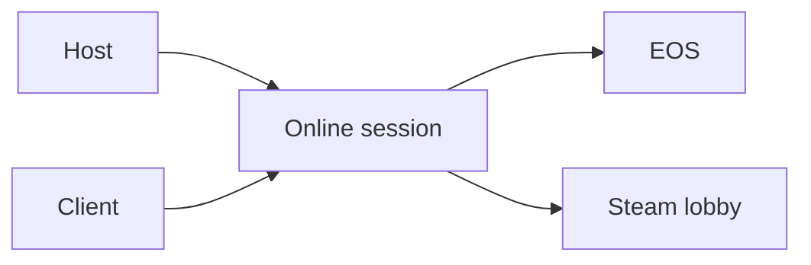

# Terminology

- **Host** - The Wayfinder player whose game owns the online session.
- **Client** - A player who joins the host.
- **UE4SS** - The runtime mod loader that loads the Lua script and native DLL.
- **EOS** - Epic Online Services, which Wayfinder uses for online sessions.
- **Steam lobby** - The Steam object used for membership and friend invitations.
- **Session capacity** - The maximum number of players accepted by the session.
- **Public spaces** - The joinable player count advertised to session searches.
- **RVA** - A relative virtual address measured from a loaded module's image base.
- **Lode** - The persistent AI-owned project knowledge in `lode/`.
- **Distribution** - Generated files prepared for a mod hosting website.
- **Mod manifest** - A `mod.json` file that defines one buildable mod package.
- **Loot record** - The loot data supplied to Wayfinder's central loot spawner.
- **Loot entry** - One probability and amount range inside a loot record.
- **Core probability multiplier** - The MoreDrops value that scales every core loot probability roll.
- **Final probability multiplier** - The MoreDrops value that scales probability for final wrapper calls.
- **Amount multiplier** - A MoreDrops value that scales one amount limit.
- **Item key** - A stable `DataTable:RowName` value that identifies a selected loot item.
- **Item probability** - The post-roll percentage that keeps a selected item stack.
- **Item catalog** - A planned item-definition list. The current UE4SS Lua generator is disabled because reflected array conversion crashes.
- **Echo rarity** - The Common, Uncommon, Rare, or Epic rarity assigned to one generated Echo. Rare is blue. Epic is purple.
- **Echo rarity allow-list** - The configured rarities that MoreDrops permits Wayfinder to append during a central loot spawn.
- **Config hot reload** - Applying a saved MoreDrops configuration before a later loot call without restarting Wayfinder.



## Example

```text
MaxPlayers=25 means 25 total session members, not 25 additional members.
[MoreDropsNative] Config reloaded means the saved MoreDrops values are active.
```

Related: [Project summary](summary.md) and [Session capacity](runtime/session-capacity.md).
