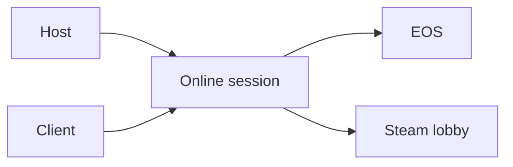

# Terminology

- **Host** - The Wayfinder player whose game owns the online session.
- **Client** - A player who joins the host.
- **UE4SS** - The runtime mod loader that loads the Lua script and native DLL.
- **EOS** - Epic Online Services, which Wayfinder uses for online sessions.
- **Steam lobby** - The Steam object used for membership and friend invitations.
- **Session capacity** - The maximum number of players accepted by the session.
- **Public spaces** - The joinable player count advertised to session searches.
- **Lode** - The persistent AI-owned project knowledge in `lode/`.
- **Distribution** - Generated files prepared for a mod hosting website.



## Example

```text
MaxPlayers=25 means 25 total session members, not 25 additional members.
```

Related: [Project summary](summary.md) and [Session capacity](runtime/session-capacity.md).
