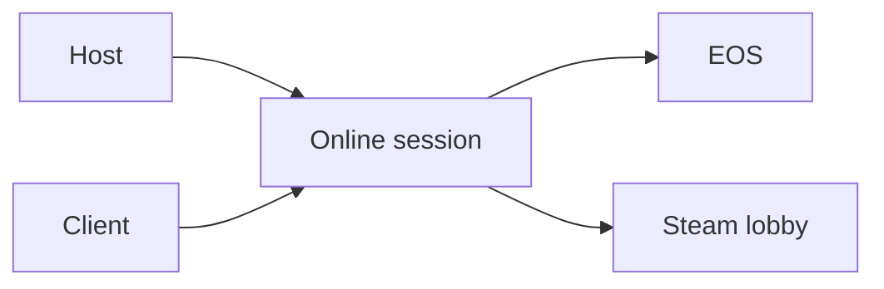

# Terminology

- **Host** - The Wayfinder player whose game owns the online session.
- **Client** - A player who joins the host.
- **UE4SS** - The runtime mod loader that loads the Lua script and native DLL.
- **EOS** - Epic Online Services, which Wayfinder uses for online sessions.
- **Steam lobby** - The Steam object used for membership and friend invitations.
- **Session capacity** - The maximum number of players accepted by the session.
- **Public spaces** - The joinable player count advertised to session searches.
- **RVA** - A relative virtual address measured from a loaded module's image base.
- **Session capacity patch** - The MorePlayers native change of four Wayfinder instructions that write `NumPublicConnections = 3` to the configured limit.
- **Local session capacity** - The `NumPublicConnections` value in the host's own named session. Outgoing EOS and Steam hooks do not change it.
- **Full-party threshold** - The player count at which Wayfinder publishes the hosted session as full. The original value is 3. MorePlayers changes it to `MaxPlayers`.
- **Lode** - The persistent AI-owned project knowledge in `lode/`.
- **Distribution** - Generated files prepared for a mod hosting website.
- **Mod manifest** - A `mod.json` file that defines one buildable mod package.
- **Loot record** - The loot data supplied to Wayfinder's central loot spawner.
- **Loot entry** - One probability and amount range inside a loot record.
- **Core probability multiplier** - The MoreDrops value that scales every core loot probability roll.
- **Final probability multiplier** - The MoreDrops value that scales probability for final wrapper calls.
- **Amount multiplier** - A MoreDrops value that scales one amount limit.
- **Item key** - A stable `DataTable:RowName` value that identifies a selected loot item.
- **Item probability** - The post-roll percentage that keeps a selected item stack.
- **Item catalog** - A planned item-definition list. The current UE4SS Lua generator is disabled because reflected array conversion crashes.
- **Echo rarity** - The Common, Uncommon, Rare, or Epic rarity assigned to one generated Echo. Rare is blue. Epic is purple.
- **Echo rarity allow-list** - The configured rarities that MoreDrops permits Wayfinder to append during a central loot spawn.
- **Accessory rarity allow-list** - The configured rarities that MoreDrops keeps for selected accessory and relic equipment. Recipe rows bypass this filter.
- **Fail open** - Keep an item when the mod cannot verify the item type or rarity.
- **Boss unique pool** - A boss-source variable that contains boss-specific equipment, cosmetics, resources, pets, titles, or Echoes.
- **Boss unique guarantee** - Expansion of each eligible boss-specific pool before authoritative item and rarity filters run.
- **Echo rarity override** - A resource-backed setting that changes an exact boss, world-boss, elite, or miniboss Echo row to Epic before the Echo rarity allow-list runs.
- **World boss** - A current overland miniboss source such as Ancient One, Bone Crusher, or Howler.
- **Rare enemy** - A Wayfinder resource asset classified as an elite or miniboss, excluding overland world bosses kept in their separate group.
- **Config hot reload** - Applying a saved MoreDrops configuration before a later loot call without restarting Wayfinder.
- **Loadout profile** - A named Loadouts record for one saved character configuration.
- **Missing part** - A saved item or style that is unavailable when Loadouts validates a profile.
- **Partial application** - Applying available profile parts after the user confirms that Loadouts can skip missing parts.
- **Trust flag** - A schema version 3 value that proves one reset-sensitive profile section came from a complete capture.
- **Reset unit** - The smallest holder, talent pool, style set, or tree that Loadouts can safely clear and rebuild.
- **Pending confirmation** - One resolved Loadouts warning that must be confirmed or canceled before another application starts.
- **GUID word** - One 32-bit GUID segment, reflected as signed and stored by Loadouts as canonical unsigned data.
- **UMG asset pack** - Cooked Loadouts interface assets stored in `Loadouts.pak`.
- **Logic mod** - A cooked Blueprint Pak that UE4SS loads from `Atlas/Content/Paks/LogicMods`.
- **Startup warning page** - A UMG page that Wayfinder shows for epilepsy or autosave information before the main menu.
- **In-game autosave indicator** - The gameplay overlay that shows when Wayfinder writes save data.



## Example

```text
MaxPlayers=25 means 25 total session members, not 25 additional members.
[MoreDropsNative] Config reloaded means the saved MoreDrops values are active.
```

Related: [Project summary](summary.md) and [Session capacity](runtime/session-capacity.md).
